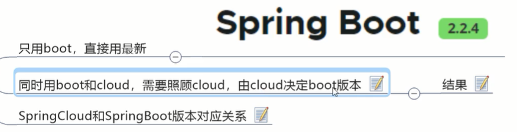

### 前言


### 微服务架构概述


你弄成分布式的了，那起码这些都要有吧：


数字化生活，肯定有一堆东西吧，分布式微服务架构一整套体系与体系之间的对抗。

所以这么多落地的技术和维度，构成分布式微服务架构的体系，强不是在一个个体，强在一个整体


所以springCloud有多维度，不然它搞不定


京东：


阿里：


京东物流：


SpringCloud技术栈：


天上飞的理念必有落地的实现


### Boot和Cloud版本选型 2.2.x和H版说起

已过时：


注意版本选型这一节，很严格，boot和cloud严格对应，跟教程也要版本一致，不然之后环境问题很大





### Cloud各种组件的停更/升级/替换

停更引发的升级惨案


Eureka已停更不停用


详细资料不是书，是官方文档：


真真正正成为一个技术熟手，熟了以后才能成为高手，成为高手之后才能成为专家


### 微服务架构编码构建


#idea新建project工作空间：


##微服务cloud整体聚合父工程Project:


1.新建项目


3.maven3.5以上


5.


6.表示支持注解


7.编译版本


8.是否想清爽点，不显示.iml .idea等用不到的文件


##父工程的pom


这一点在maven的聚合，传递依赖详细讲过

父工程主要有这个pom文件(src什么的删掉啊)，通过dpendencyManager标签来让子模块继承，让我们拥有统一的版本号


把依赖复制：

```xml
<!--统一管理jar包版本-->
<properties>
  <project.build.sourceEncoding>UTF-8</project.build.sourceEncoding>
  <maven.compiler.source>1.8</maven.compiler.source>
  <maven.compiler.target>1.8</maven.compiler.target>
  <junit.version>4.12</junit.version>
  <log4j.version>1.2.17</log4j.version>
  <lombok.version>1.16.18</lombok.version>
  <mysql.version>5.1.47</mysql.version>
  <druid.version>1.1.16</druid.version>
  <mybatis.spring.boot.version>1.3.0</mybatis.spring.boot.version>
</properties>

<!--子模块继承后，提供作用:锁定版本+子module不用写groupId和version-->
<!--前边三个基本是分布式微服务必备-->
<dependencyManagement>
  <dependencies>
    <!--spring boot 2.2.2-->
    <dependency>
      <groupId>org.springframework.boot</groupId>
      <artifactId>spring-boot-dependencies</artifactId>
      <version>2.2.2.RELEASE</version>
      <type>pom</type>
      <scope>import</scope>
    </dependency>
    <!--spring cloud Hoxton.SR1-->
    <dependency>
      <groupId>org.springframework.cloud</groupId>
      <artifactId>spring-cloud-dependencies</artifactId>
      <version>Hoxton.SR1</version>
      <type>pom</type>
      <scope>import</scope>
    </dependency>
    <!--spring cloud alibaba 2.1.0.RELEASE-->
    <dependency>
      <groupId>com.alibaba.cloud</groupId>
      <artifactId>spring-cloud-alibaba-dependencies</artifactId>
      <version>2.1.0.RELEASE</version>
      <type>pom</type>
      <scope>import</scope>
    </dependency>
    <!--mysql-->
    <dependency>
      <groupId>mysql</groupId>
      <artifactId>mysql-connector-java</artifactId>
      <version>${mysql.version}</version>
      <scope>runtime</scope>
    </dependency>
    <!-- druid-->
    <dependency>
      <groupId>com.alibaba</groupId>
      <artifactId>druid</artifactId>
      <version>${druid.version}</version>
    </dependency>
    <!--mybatis-->
    <dependency>
      <groupId>org.mybatis.spring.boot</groupId>
      <artifactId>mybatis-spring-boot-starter</artifactId>
      <version>${mybatis.spring.boot.version}</version>
    </dependency>
    <!--junit-->
    <dependency>
      <groupId>junit</groupId>
      <artifactId>junit</artifactId>
      <version>${junit.version}</version>
    </dependency>
    <!--log4j-->
    <dependency>
      <groupId>log4j</groupId>
      <artifactId>log4j</artifactId>
      <version>${log4j.version}</version>
    </dependency>

  </dependencies>
</dependencyManagement>
```


##maven细节复习


dependencyManagement能让所有子项目中引用一个依赖而不用显式列出版本号


maven中跳过单元测试：


发布到本地mvn仓库：


