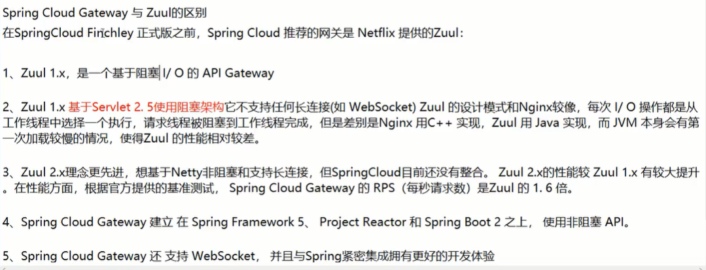

服务网关

微服务架构里的一个重要模块

几乎所有的微服务架构里都需要有网关，让它统一的挡在前面 进行日志，限流，鉴权限，安全加固等工作


技术选型上，zuul你自己去调研，有笔记

# Gateway新一代网关


## 概述

### 官网


更加符合新技术和未来趋势


### 是什么


### 能干什么


### 微服务架构中网关在哪里


一般企业架构就是这样


### 有Zuul了怎么又出来gateway


#为什么选择gateway





#zuul1模型


#gateway模型


就是要用异步非阻塞！


## 三大核心概念


### 路由


你进了网关以后，根据路由匹配规则对你转发，到微服务

### 断言


参考函数式编程

### 过滤


## gateway工作流程


这样的话对我们的构建会有非常大的帮助

gateway的核心逻辑就是：路由转发+执行过滤器链


## 入门配置


### 新建模块


```xml
<dependencies>
    <dependency>
        <groupId>org.springframework.cloud</groupId>
        <artifactId>spring-cloud-starter-gateway</artifactId>
    </dependency>
    <dependency>
        <groupId>org.springframework.cloud</groupId>
        <artifactId>spring-cloud-starter-netflix-eureka-client</artifactId>
    </dependency>
    <dependency>
        <groupId>com.atguigu.springcloud</groupId>
        <artifactId>cloud-api-commons</artifactId>
        <version>${project.version}</version>
    </dependency>
    <!--请移除<dependency>
        <groupId>org.springframework.boot</groupId>
        <artifactId>spring-boot-starter-web</artifactId>
    </dependency>
    <dependency>
        <groupId>org.springframework.boot</groupId>
        <artifactId>spring-boot-starter-actuator</artifactId>
    </dependency>-->
    <dependency>
        <groupId>org.springframework.boot</groupId>
        <artifactId>spring-boot-devtools</artifactId>
        <scope>runtime</scope>
        <optional>true</optional>
    </dependency>
    <dependency>
        <groupId>org.projectlombok</groupId>
        <artifactId>lombok</artifactId>
        <optional>true</optional>
    </dependency>
    <dependency>
        <groupId>org.springframework.boot</groupId>
        <artifactId>spring-boot-starter-test</artifactId>
        <scope>test</scope>
    </dependency>

</dependencies>
```


```yml
server:
  port: 9527

spring:
  application:
    name: cloud-gateway


eureka:
  instance:
    hostname: cloud-gateway-service
  client:
    register-with-eureka: true
    service-url:
      defaultZone: http://eureka7001.com:7001/eureka
```


```java
@SpringBootApplication
@EnableEurekaClient
public class GateWayMain9527 {
    public static void main(String[] args) {
        SpringApplication.run(GateWayMain9527.class,args);
    }
}
```


### 网关如何做路由映射


### yml新增网关配置

```yml
spring:
  application:
    name: cloud-gateway
  cloud:
    gateway:
      routes:
        - id: payment_routh  #路由的id，没有固定规则但要求唯一，建议配合服务名
          uri: http://localhost:8001  #匹配后提供服务的路由地址
          predicates:
            - Path=/payment/get/**   #断言，路径相匹配的进行路由

        - id: payment_routh2
          uri: http://localhost:8001
          predicates:
            - Path=/payment/lb/**
```


### 测试


慢慢的就淡化真实端口，转成统一网关9527

访问说明：


### yml配置说明


用编码的方式进行路由配置


#官网案例


#


#


## 通过微服务名实现动态路由


之前负载均衡由ribbon实现

现在使用了网关，服务端要配置多个微服务，就需要网关来实现负载均衡


#


#


#


#


```yml
spring:
  application:
    name: cloud-gateway
  cloud:
    gateway:
      discovery:
        locator:
          enabled: true  #开启从注册中心动态创建路由的功能，利用微服务名进行路由
      routes:
        - id: payment_routh  #路由的id，没有固定规则但要求唯一，建议配合服务名
          #uri: http://localhost:8001  #匹配后提供服务的路由地址
          uri: lb://CLOUD-PAYMENT-SERVICE  #匹配后提供服务的路由地址
          predicates:
            - Path=/payment/get/**   #断言，路径相匹配的进行路由

        - id: payment_routh2
          #uri: http://localhost:8001
          uri: lb://CLOUD-PAYMENT-SERVICE  #匹配后提供服务的路由地址
          predicates:
            - Path=/payment/lb/**

```


测试成功


## Predicate的使用


### 是什么


### 路由断言工厂


### 常用的路由断言


#After

在xxxx时间之后


配置好配，但这个时间格式怎么搞到

写个配置类，测试类


得到本时区一个当前时间


```java
public class T {
    public static void main(String[] args) {
        ZonedDateTime zbj = ZonedDateTime.now();
        System.out.println(zbj);
        //2021-08-11T14:09:57.949+08:00[Australia/Perth]
    }
}
```


```yml
predicates:
  - Path=/payment/lb/**
  - After=2021-08-11T15:09:57.949+08:00[Australia/Perth]
```


这个路由配置就像网管一样的配置，相当顺滑

比如一个功能了不起提前上线，但3月27才起效


#Before  Between


#

一般分布式微服务测试工具，

发一些http等请求


#Cookie


发了一个get请求，不带cookie，就404


#


看技术帖子


#Header


#Host  Method  Path  Query你自己弄，都很简单


#


后续我们的断言，就获得了强大的功能加持


## Filter


请求进入网关，通过：路由、断言、层层的过滤器，最终达到微服务

三关合适的才能过来，达到精细的控制

### 是什么


### 网关的Filter


GatewayFilter 单一的：


照着官网自己尝试就可以了：


GlobalFilter 全局的：


### 常用的


跟官网一样，阳哥也是来自于官网


### 自定义过滤器


手动做一下


getOrder就是顺序，不就是值越小优先级越高


```java
@Component
@Slf4j
public class MyLogGateWayFillter implements GlobalFilter, Ordered {
    @Override
    public Mono<Void> filter(ServerWebExchange exchange, GatewayFilterChain chain) {
        log.info("*****************come in MyLogGateWayFillter:  "+new Date());
        String uname = exchange.getRequest().getQueryParams().getFirst("uname");
        if(uname==null){
            log.info("*********用户名为null，非法用户");
            //设置个状态码
            exchange.getResponse().setStatusCode(HttpStatus.NOT_ACCEPTABLE);
            //设置响应完成
            return exchange.getResponse().setComplete();
        }
        //否则就放行，后面的过滤器继续进行验证
        return chain.filter(exchange);
    }

    @Override
    public int getOrder() {
        return 0;
    }
}
```

就是实现这两个接口，然后注入容器


#测试


只要带着uname就ok


用代码写的过滤器，

那些什么30多种常用的没什么意义，一般就是用自定义的全局


测试成功


