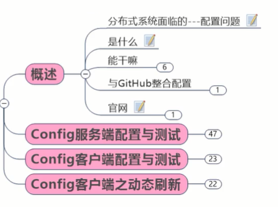
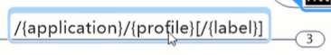
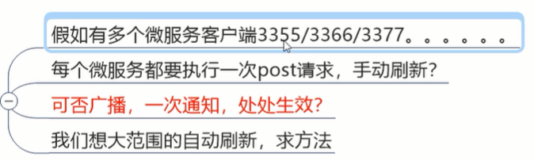

# 概述

每一个微服务都有一个文件叫application.yml

有些微服务都连统一的数据库

东西多了就需要有统一的管理

如果你有40个微服务，要改数据库配置，就要改40次，疯啦，运维工程师天天改配置就行了

## 分布式微服务面临的严重的配置问题


## 是什么


## 能干吗


## 与github整合配置


## 官网


# Config服务端配置与测试


```xml
<dependencies>
    <dependency>
        <groupId>org.springframework.cloud</groupId>
        <artifactId>spring-cloud-config-server</artifactId>
    </dependency>
    <dependency>
        <groupId>org.springframework.cloud</groupId>
        <artifactId>spring-cloud-starter-netflix-eureka-client</artifactId>
    </dependency>
    <dependency>
        <groupId>com.atguigu.springcloud</groupId>
        <artifactId>cloud-api-commons</artifactId>
        <version>${project.version}</version>
    </dependency>
    <dependency>
        <groupId>org.springframework.boot</groupId>
        <artifactId>spring-boot-starter-web</artifactId>
    </dependency>
    <dependency>
        <groupId>org.springframework.boot</groupId>
        <artifactId>spring-boot-starter-actuator</artifactId>
    </dependency>
    <dependency>
        <groupId>org.springframework.boot</groupId>
        <artifactId>spring-boot-devtools</artifactId>
        <scope>runtime</scope>
        <optional>true</optional>
    </dependency>
    <dependency>
        <groupId>org.projectlombok</groupId>
        <artifactId>lombok</artifactId>
        <optional>true</optional>
    </dependency>
    <dependency>
        <groupId>org.springframework.boot</groupId>
        <artifactId>spring-boot-starter-test</artifactId>
        <scope>test</scope>
    </dependency>
</dependencies>
```


```yml
server:
  port: 3344


spring:
  application:
    name: cloud-config-center
  cloud:
    config:
      server:
        git:
          uri: https://github.com/965917582/springcloud-config
          search-paths:
            - /
          username: 965917582
          password: 48Minecraft
      label: master  #读取分支


#服务注册到eureka
eureka:
  client:
    service-url:
      defaultZone: http://eureka7001.com:7001/eureka
```


```java
@SpringBootApplication
@EnableConfigServer
public class ConfigCenterMain3344 {
    public static void main(String[] args) {
        SpringApplication.run(ConfigCenterMain3344.class,args);
    }
}
```


#配置读取规则


##

阳哥最推荐


##

默认先去找master分支


##

出json,自己解析


#配置总结


# Config客户端配置与测试


```xml
<dependencies>
        <dependency>
            <groupId>org.springframework.cloud</groupId>
            <!--注意artifactId-->
            <artifactId>spring-cloud-starter-config</artifactId>
        </dependency>
        <dependency>
            <groupId>org.springframework.cloud</groupId>
            <artifactId>spring-cloud-starter-netflix-eureka-client</artifactId>
        </dependency>
        <dependency>
            <groupId>com.atguigu.springcloud</groupId>
            <artifactId>cloud-api-commons</artifactId>
            <version>${project.version}</version>
        </dependency>
        <dependency>
            <groupId>org.springframework.boot</groupId>
            <artifactId>spring-boot-starter-web</artifactId>
        </dependency>
        <dependency>
            <groupId>org.springframework.boot</groupId>
            <artifactId>spring-boot-starter-actuator</artifactId>
        </dependency>
        <dependency>
            <groupId>org.springframework.boot</groupId>
            <artifactId>spring-boot-devtools</artifactId>
            <scope>runtime</scope>
            <optional>true</optional>
        </dependency>
        <dependency>
            <groupId>org.projectlombok</groupId>
            <artifactId>lombok</artifactId>
            <optional>true</optional>
        </dependency>
        <dependency>
            <groupId>org.springframework.boot</groupId>
            <artifactId>spring-boot-starter-test</artifactId>
            <scope>test</scope>
        </dependency>
    </dependencies>
```


## bootstrap.yml


### 是什么


bootstrap.yml是系统级的，跟config-server沟通；application.yml跟自己沟通

bootstrap.yml优先级更高，先加载它，拼起来才是最后客户端的配置文件

bootstrap.yml是总控的


### 内容

```yml
server:
  port: 3355

spring:
  application:
    name: config-client
  cloud:
    config:
      #Config客户端配置
      label: master  #分支名
      name: config  #配置文件名
      profile: dev  #后缀名        上述综合：master分支的config-dev.yml配置文件被读取
      uri: http://localhost:3344  #配置中心地址


eureka:
  client:
    service-url:
      defaultZone: http://eureka7001.com:7001/eureka
```


## 修改config-dev.yml配置并提交，如某变量或版本号

## 主启动


```java
@EnableEurekaClient
@SpringBootApplication
public class ConfigClientMain3355 {
    public static void main(String[] args) {
        SpringApplication.run(ConfigClientMain3355.class,args);
    }
}
```


注意：


既然暴露了，我客户端用rest风格就能读到

```java
@RestController
public class ConfigClientController {
    @Value("${config.info}")
    private String configInfo;

    @GetMapping("/configInfo")
    public String getConfigInfo(){
        return configInfo;
    }
}
```

之前在config-dev.yml配了config.info

## 测试


测试成功

## 问题随之而来，分布式配置的动态刷新问题


# Config客户端的动态刷新


### 动态刷新步骤


actuator监控除了网关别加，其它都得加，

有了这个插件以后，我自己发生变化了，能被别人监控到


3355添加：

```yml
#暴露监控端点
management:
  endpoints:
    web:
      exposure:
        include: "*"
```


 


测试成功


### 还有什么问题




目前做不到，所以引入下一章---->消息总线


