Bus是对Config的一个加强

广播型的自动型的动态刷新，是Config的绝配，基本上是绝代双骄

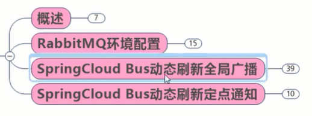

# 概述

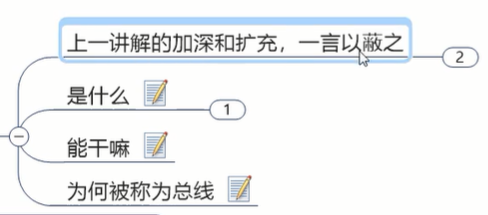


## 上一讲的加深和扩充


## 是什么


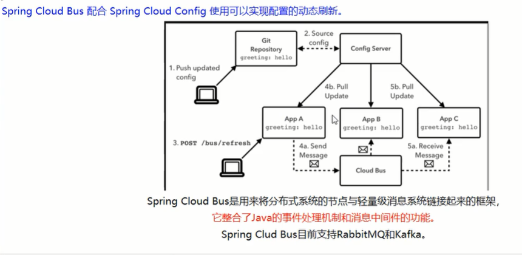

## 能干吗

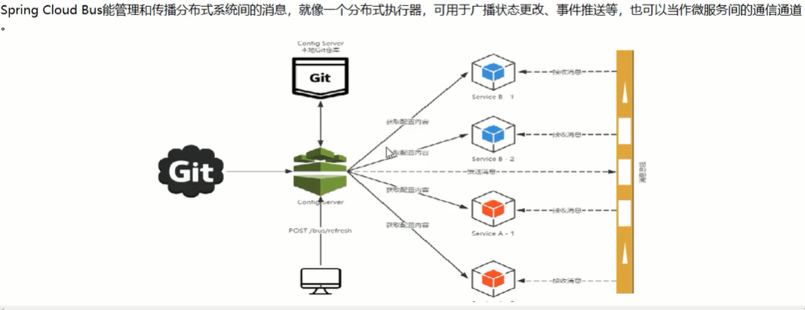


## 为什么被称为总线


说白了就是springcloud做了一个消息总线的机制，跟rabbitmq/kafka整合，实现事件监听、通知的功能

(这样就实现了广播通知的功能，避免逐个通知)


# RabbitMQ环境配置

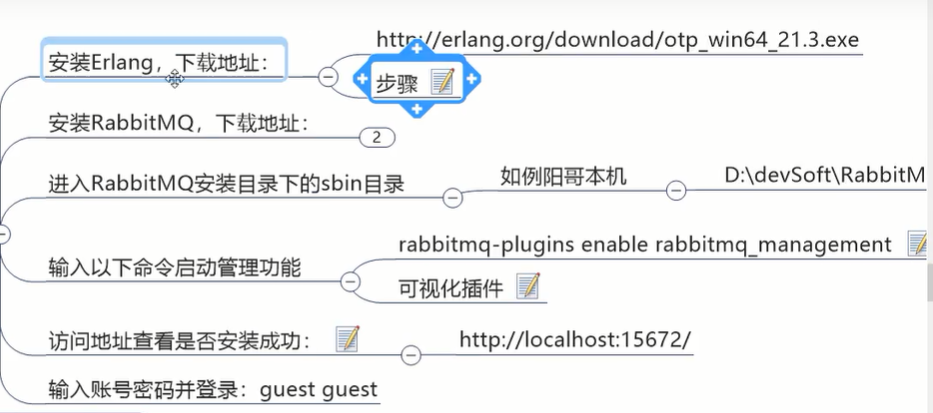


# Bus动态刷新全局广播

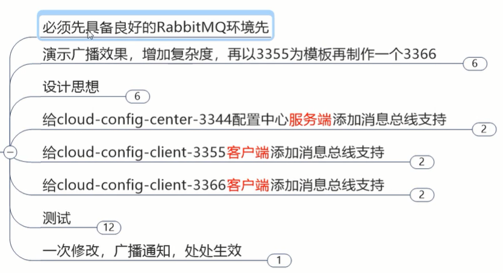


### 增加config客户端3366

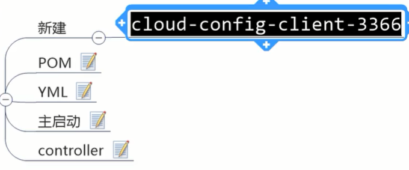

### 设计思想


#1

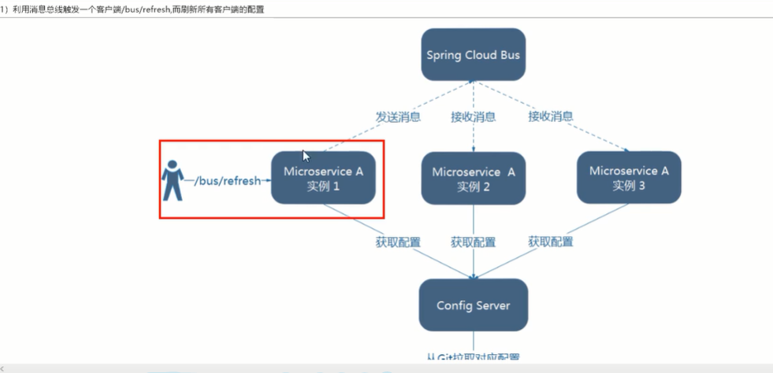


#2

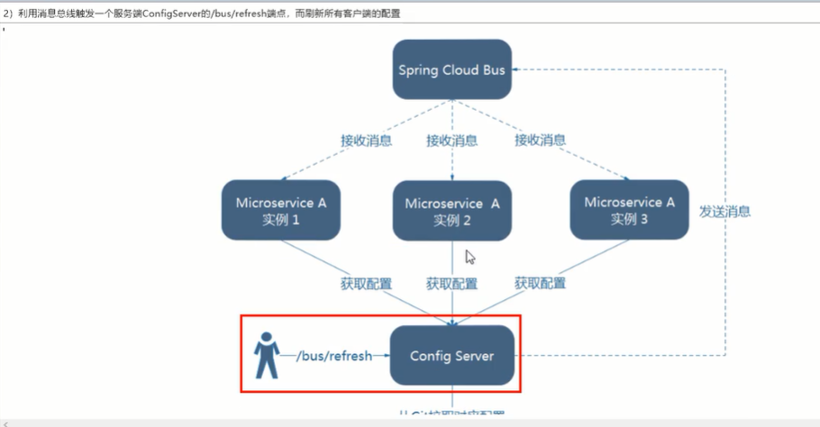

图二的架构显然更加合适


所以采用通知总控


### 3344服务端添加消息总线支持


```xml
<!--添加消息总线RabbitMQ支持-->
<dependency>
    <groupId>org.springframework.cloud</groupId>
    <artifactId>spring-cloud-starter-bus-amqp</artifactId>
</dependency>
```


```yml
#rabbitmq相关配置
spring:
    rabbitmq:
      host: localhost
      port: 5672 #15672是web管理界面的端口，5672是mq访问的端口
      username: guest
      password: guest


#rabbitmq相关配置，暴露bus刷新配置的端点
management:
  endpoints:
    web:
      exposure:
        include: 'bus-refresh'
```

凡是要暴露这种监控啊刷新的，都要有actuator依赖


### 3355客户端添加消息总线支持

<!--添加消息总线RabbitMQ支持-->
<dependency>
    <groupId>org.springframework.cloud</groupId>
    <artifactId>spring-cloud-starter-bus-amqp</artifactId>
</dependency>


#rabbitmq相关配置
spring:
    rabbitmq:
      host: localhost
      port: 5672 #15672是web管理界面的端口，5672是mq访问的端口
      username: guest
      password: guest


### 3366客户端添加消息总线支持

一样


### 测试

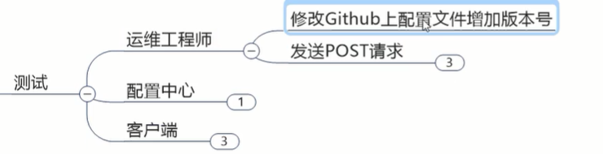

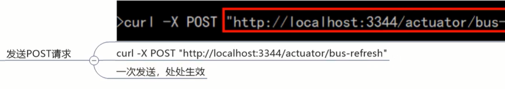

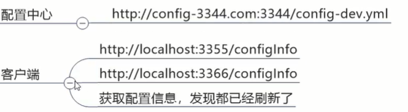


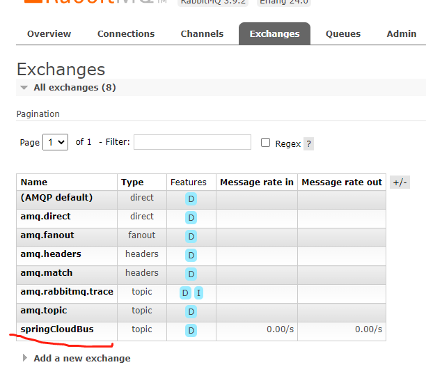

看mq控制台有消息进出

测试成功，有时候冲了post刷新可能不管用


# Bus动态刷新定点通知

精确打击 

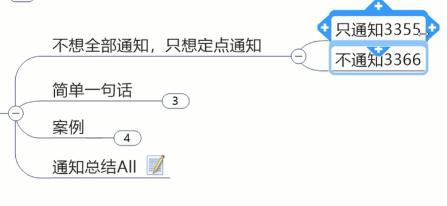

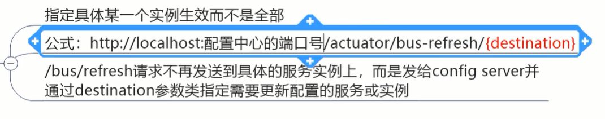


目的地：微服务+端口号


# 通知总结

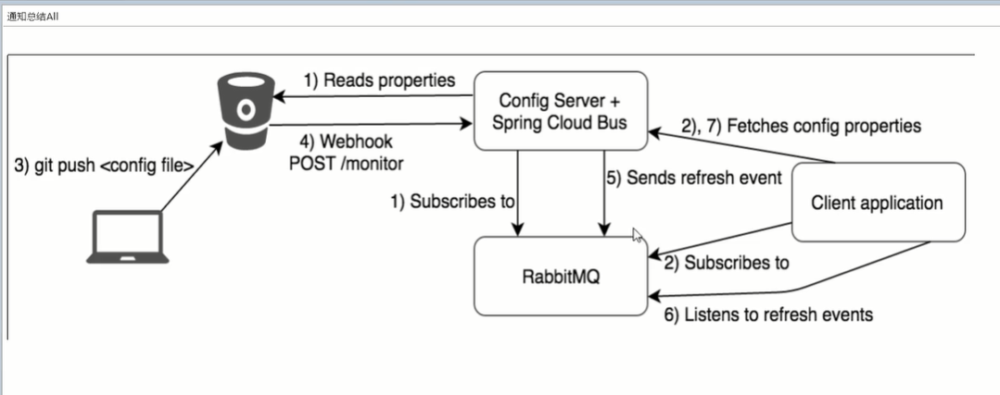


**我感觉消息总线能玩花活**

