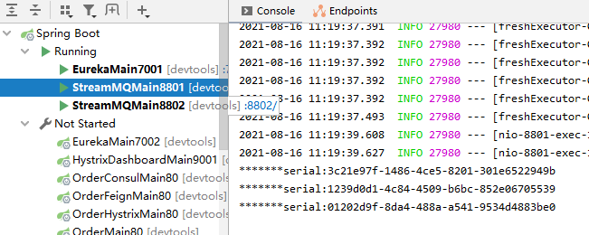

cloud-Stream

为什么引入cloud Stream?


熟悉一个消息队列中间件就已经不错了，项目中比如后端在用rabbitmq，大数据端在用kafka，你还要会这么多，光学习就老长时间，所以提供一个服务来统一消息的编程模型


# 消息驱动概述


## 是什么


## 设计思想


#标准MQ:


#为什么用cloud Stream


#遵循发布-订阅模式


## 标准流程套路


## 编码API和常用注解


#注解


# 案例说明


# 消息驱动之生产者


```xml
<dependencies>
    <dependency>
        <groupId>org.springframework.cloud</groupId>
        <artifactId>spring-cloud-starter-stream-rabbit</artifactId>
    </dependency>
    <dependency>
        <groupId>org.springframework.cloud</groupId>
        <artifactId>spring-cloud-starter-netflix-eureka-client</artifactId>
    </dependency>
    <dependency>
        <groupId>com.atguigu.springcloud</groupId>
        <artifactId>cloud-api-commons</artifactId>
        <version>${project.version}</version>
    </dependency>
    <dependency>
        <groupId>org.springframework.boot</groupId>
        <artifactId>spring-boot-starter-web</artifactId>
    </dependency>
    <dependency>
        <groupId>org.springframework.boot</groupId>
        <artifactId>spring-boot-starter-actuator</artifactId>
    </dependency>
    <dependency>
        <groupId>org.springframework.boot</groupId>
        <artifactId>spring-boot-devtools</artifactId>
        <scope>runtime</scope>
        <optional>true</optional>
    </dependency>
    <dependency>
        <groupId>org.projectlombok</groupId>
        <artifactId>lombok</artifactId>
        <optional>true</optional>
    </dependency>
    <dependency>
        <groupId>org.springframework.boot</groupId>
        <artifactId>spring-boot-starter-test</artifactId>
        <scope>test</scope>
    </dependency>
</dependencies>
```

```yml
server:
  port: 8801

spring:
  application:
    name: cloud-stream-provider
  cloud:
    stream:
      binders:  #此处配置要绑定的rabbitmq的服务信息
        defaultRabbit:  #表示定义的名称，用于binding整合
          type: rabbit  #消息组件类型
          environment:  #设置rabbitmq的相关的环境配置
            spring:
              rabbitmq:
                host: localhost
                port: 5672
                username: guest
                password: guest
      bindings:  #服务的整合处理
        output:  #这个名字是一个通道的名称
          destination: studyExchange  #表示要使用的Exchnage名称定义
          content-type: application/json  #设置消息类型，本次为json，文本则设置"text/plain"
          binder: defaultRabbit  #设置要绑定的消息服务的具体设置

eureka:
  client:
    service-url:
      defaultZone: http://eureka7001.com:7001/eureka #单机版
  instance:
    lease-renewal-interval-in-seconds: 2  #设置心跳的时间间隔(默认是30秒)
    lease-expiration-duration-in-seconds: 5  #超时时间
    instance-id: send-8801.com  #在信息列表时显示主机名称
    prefer-ip-address: true  #访问的路径变为ip地址


```


```java
@SpringBootApplication
public class StreamMQMain8801 {
    public static void main(String[] args) {
        SpringApplication.run(StreamMQMain8801.class,args);
    }
}
```


```yml
server:
  port: 8801

spring:
  application:
    name: cloud-stream-provider
  cloud:
    stream:
      binders:  #此处配置要绑定的rabbitmq的服务信息
        defaultRabbit:  #表示定义的名称，用于binding整合
          type: rabbit  #消息组件类型
          environment:  #设置rabbitmq的相关的环境配置
            spring:
              rabbitmq:
                host: localhost
                port: 5672
                username: guest
                password: guest
      bindings:  #服务的整合处理
        output:  #这个名字是一个通道的名称
          destination: studyExchange  #表示要使用的Exchnage名称定义
          content-type: application/json  #设置消息类型，本次为json，文本则设置"text/plain"
          binder: defaultRabbit  #设置要绑定的消息服务的具体设置

eureka:
  client:
    service-url:
      defultZone: http://localhost:7001/eureka
  instance:
    lease-renewal-interval-in-seconds: 2  #设置心跳的时间间隔(默认是30秒)
    lease-expiration-duration-in-seconds: 5  #超时时间
    instance-id: send-8801.com  #在信息列表时显示主机名称
    prefer-ip-address: true  #访问的路径变为ip地址
```


```yml
server:
  port: 8801

spring:
  application:
    name: cloud-stream-provider
  cloud:
    stream:
      binders:  #此处配置要绑定的rabbitmq的服务信息
        - defaultRabbit:  #表示定义的名称，用于binding整合
            type: rabbit  #消息组件类型
            environment:  #设置rabbitmq的相关的环境配置
              spring:
                rabbitmq:
                  host: localhost
                  port: 5672
                  username: guest
                  password: guest
      bindings:  #服务的整合处理
        - output:  #这个名字是一个通道的名称
            destination: studyExchange  #表示要使用的Exchnage名称定义
            content-type: application/json  #设置消息类型，本次为json，文本则设置"text/plain"
            binder: defaultRabbit  #设置要绑定的消息服务的具体设置

eureka:
  client:
    service-url:
      register-with-eureka: false
      fetch-registry: false
      defaultZone: http://eureka7001.com:7001/eureka #单机版
  instance:
    lease-renewal-interval-in-seconds: 2  #设置心跳的时间间隔(默认是30秒)
    lease-expiration-duration-in-seconds: 5  #超时时间
    instance-id: send-8801.com  #在信息列表时显示主机名称
    prefer-ip-address: true  #访问的路径变为ip地址


```


你怎么知道这么写？

我也是读官网之后知道的

```java
public interface IMessageProvider {
    public String send();
}
```


```java
@EnableBinding(Source.class) //定义消息的推送管道
public class MessageProviderImpl implements IMessageProvider {
    @Resource
    private MessageChannel output; //消息发送管道

    @Override
    public String send() {
        String serial = UUID.randomUUID().toString();
        output.send(MessageBuilder.withPayload(serial).build());
        System.out.println("*******serial:"+serial );
        return null;
    }
}
```

```java
@RestController
public class SendMessageController {
    @Resource
    private IMessageProvider messageProvider;

    @GetMapping(value="/sendMessage")
    public String sendMessage(){
        return messageProvider.send();
    }
}
```


可以看到现在没有用任何的rabbitmq的api，就把消息推给了rabbitmq


# 消息驱动之消费者


pom一样

yml区别：


```yml
server:
  port: 8802

spring:
  application:
    name: cloud-stream-consumer
  cloud:
    stream:
      binders:  #此处配置要绑定的rabbitmq的服务信息
        defaultRabbit:  #表示定义的名称，用于binding整合
          type: rabbit  #消息组件类型
          environment:  #设置rabbitmq的相关的环境配置
            spring:
              rabbitmq:
                host: localhost
                port: 5672
                username: guest
                password: guest
      bindings:  #服务的整合处理
        input:  #这个名字是一个通道的名称
          destination: studyExchange  #表示要使用的Exchnage名称定义
          content-type: application/json  #设置消息类型，本次为json，文本则设置"text/plain"
          binder: defaultRabbit  #设置要绑定的消息服务的具体设置

eureka:
  client:
    service-url:
      defaultZone: http://eureka7001.com:7001/eureka #单机版
  instance:
    lease-renewal-interval-in-seconds: 2  #设置心跳的时间间隔(默认是30秒)
    lease-expiration-duration-in-seconds: 5  #超时时间
    instance-id: receive-8802.com  #在信息列表时显示主机名称
    prefer-ip-address: true  #访问的路径变为ip地址
```


```java
@SpringBootApplication
public class StreamMQMain8802 {
    public static void main(String[] args) {
        SpringApplication.run(StreamMQMain8802.class,args);
    }
}
```


```java
@Component
@EnableBinding(Sink.class)
public class ReceiveMessageListenerController {
    @Value("${server.port}")
    private String serverPort;

    @StreamListener(Sink.INPUT)
    public void input(Message<String> message){
        System.out.println("消费者1号，------>接收到的消息: "+message.getPayload()+"\t  port: "+serverPort);
    }
}
```





测试成功，不错


# 分组消费与持久化


这两个问题要解决，否则cloud启动以后会给你找麻烦


## 消费


打开交换器：


## 分组


#手动分在不同组


#手动分在同一组


## 持久化


加了group属性，宕机重启后仍然消费宕机时发送到消息队列的消息，防止消息丢失


