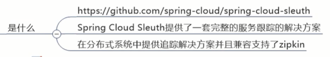

# 概述


分布式调用链路里，调用了哪些微服务，调用到哪里，哪个微服务延时了，哪个出错了。就需要一个跟踪，把问题及时发现


当你链路多的时候：




能获得链路调用的完整的轨迹图

谁调谁就记录下来，然后在网页展示，sleuth负责收集整理，zipkin负责展现


# 搭建链路监控步骤


## zipkin


#完整的调用链路


就拿以前的80调8001

## 服务提供者8001

```xml
<!--包含了sleuth+zipkini-->
<dependency>
    <groupId>org.springframework.cloud</groupId>
    <artifactId>spring-cloud-starter-zipkin</artifactId>
</dependency>
```


```yml
spring:
  zipkin:
    base-url: http://localhost:9411
  sleuth:
    sampler:
        #采样率值介于0到1之间，1则表示全部采集
      probability: 1
```


```java
@GetMapping("/payment/zipkin")
public String paymentZipkin(){
    return "hi,I am payment zipkin server fall back.";
}
```

## 服务消费者80

也pom

也yml

```java
@GetMapping("/consumer/payment/zipkin")
public String paymentZipkin(){
    String result = restTemplate.getForObject("http://localhost:8001"+"/payment/zipkin/",String.class);
    return result;
}
```


## 测试


#原理：


trace id

span id

parent id


