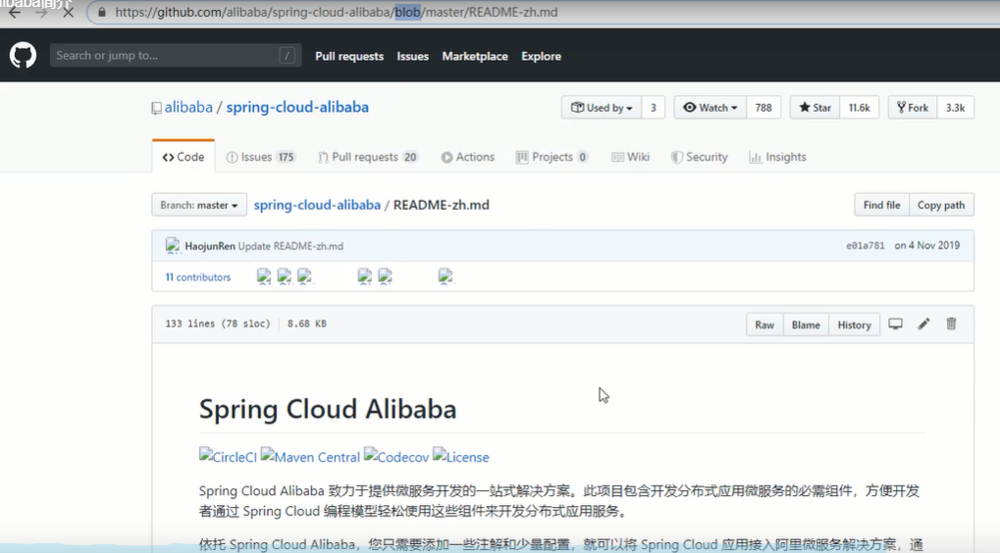

请大家继续挺立在孤独，失败和虚无的废墟上，将我们springcloud的学习进行到底

# 为什么会出现springcloud alibaba

外部敌人都是小事，主要矛盾出现在内部

整个springcloud netflix项目进入维护模式

看官网：

导致我们很被动

维护模式：除了一些重要的问题修修补补，其它几乎不考虑了

商业间的爱恨情仇：

互相捅刀子--->双方已整合

# springcloud alibaba带来了什么

#是什么

#能干吗

几乎可以把springcloud netflix完全替换了

#去哪下

在总工程pom里你怎么知道要引入springcloud alibaba呢？

就是从官网粘过来的，明白？

你现在这样一粘，就是集成了spring cloud H版和springcloud alibaba，哪个好用用哪个，多种技术并存

#怎么玩

# springcloud alibaba学习资料获取

以后出事了去哪查：

全套的官方参考手册，共计12章：

提供全套解决方案

**如果你要查springcloud alibaba，先查官网！然后再查csdn,github的帖子**

