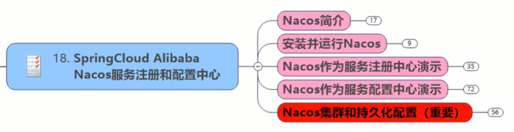

# 简介

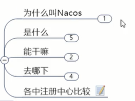

## 为什么叫nacos


服务命名(注册)和配置


## 是什么

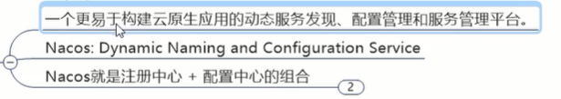


## 能干吗


## 去哪下


github，官方中文网站，官方文档

阳哥的知识也是这样一点点儿抠出来的


## 注册中心比较

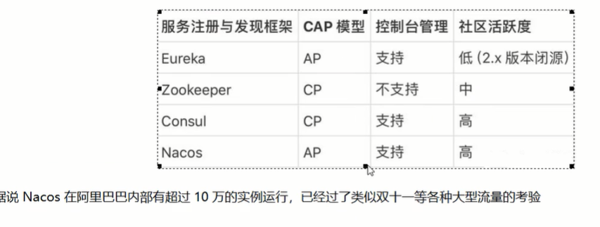

# 安装并运行

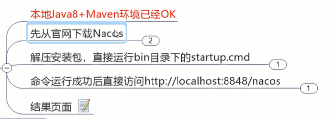


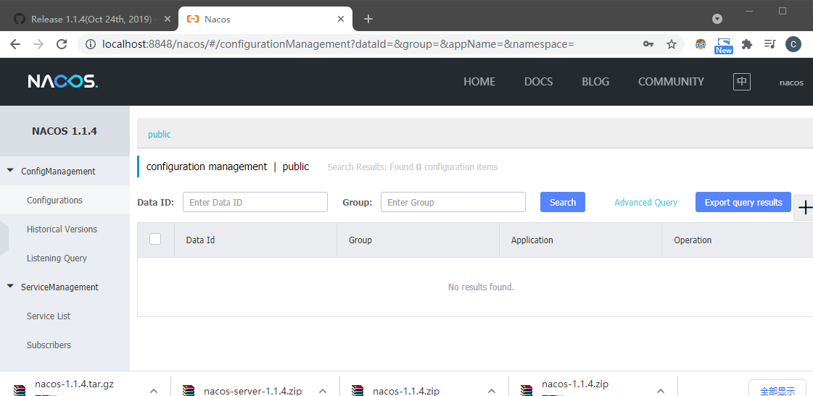


# 作为服务注册中心


## 服务提供者

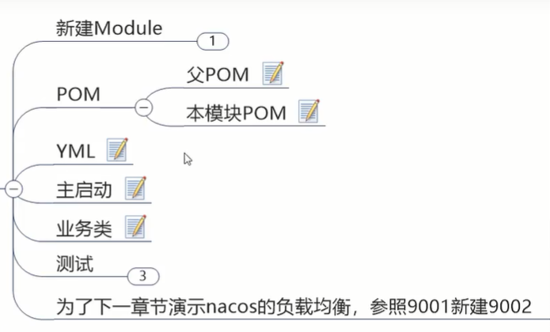

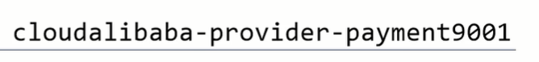

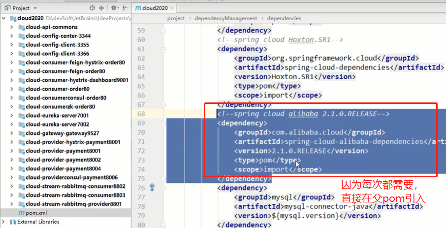


```xml
<!--SpringCloud alibaba nacos-->
<dependency>
    <groupId>com.alibaba.cloud</groupId>
    <artifactId>spring-cloud-starter-alibaba-nacos-discovery</artifactId>
</dependency>
```

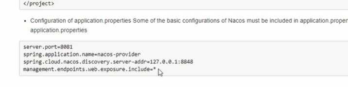

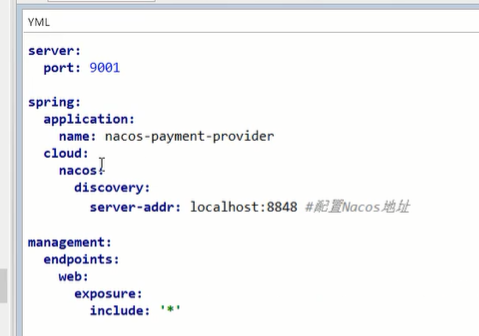


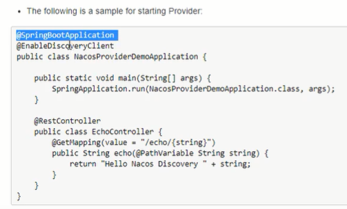

```java
@SpringBootApplication
@EnableDiscoveryClient
public class NacosProviderDemoApplication {
    public static void main(String[] args) {
        SpringApplication.run(NacosProviderDemoApplication.class,args);
    }
}
```


```java
@RestController
public class PaymentController {
    @Value("${server.port}")
    private String serverPort;

    @GetMapping(value = "/payment/nacos/{id}")
    public String getPayment(@PathVariable("id") Integer id){
        return "nacos registry , serverPort: "+serverPort+"\t id: "+id;
    }
}
```


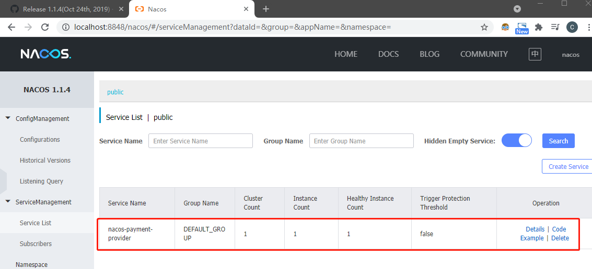


#

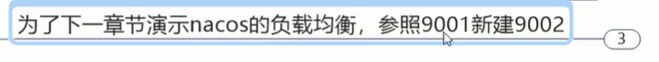

nacos是自带了负载均衡功能


拷贝虚拟端口毕竟是虚拟的，玩玩就好

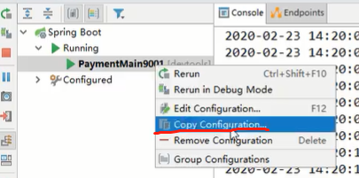


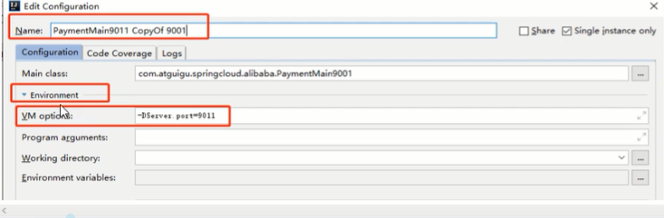


## 服务消费者

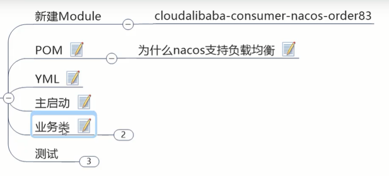

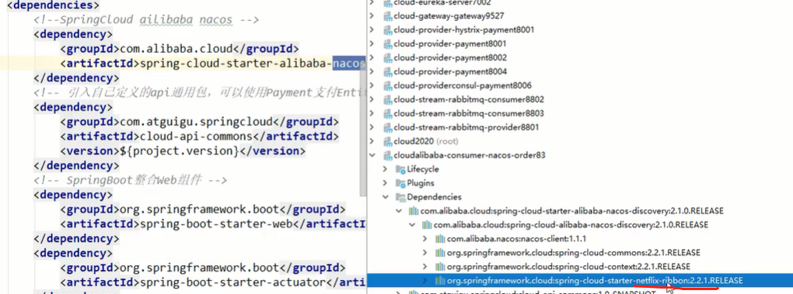


```yml
server:
  port: 83

spring:
  application:
    name: nacos-payment-consumer
  cloud:
    nacos:
      discovery:
        server-addr: localhost:8848

#消费者将要去访问的微服务名称(注册成功进nacos的微服务提供者)
service-url:
  nacos-user-service: http://nacos-payment-provider
```


```java
@SpringBootApplication
@EnableDiscoveryClient
public class PaymentMain9002 {
    public static void main(String[] args) {
        SpringApplication.run(PaymentMain9002.class,args);
    }
}
```


因为集成了ribbon ，所以有restTemplate

```java
@Configuration
public class ApplicationContextConfig {

    @Bean
    @LoadBalanced
    public RestTemplate getRestTemplate(){
        return new RestTemplate();
    }
}
```


```java
@RestController
@Slf4j
public class OrderNacosController {
    @Resource
    private RestTemplate restTemplate;
    
    @Value("${service-url.nacos-user-service}")
    private String serverURL;
    
    @GetMapping(value = "/consumer/payment/nacos/{id}")
    public String paymentInfo(@PathVariable("id")Long id){
        return restTemplate.getForObject(serverURL+"/payment/nacos/"+id,String.class);
    }
}
```


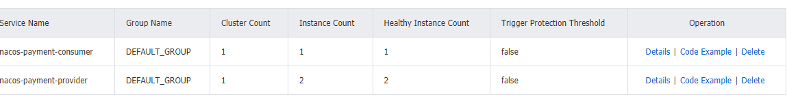


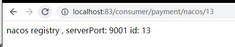


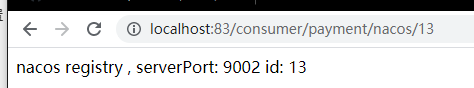

测试成功


## 注册中心对比

切换AP，CP


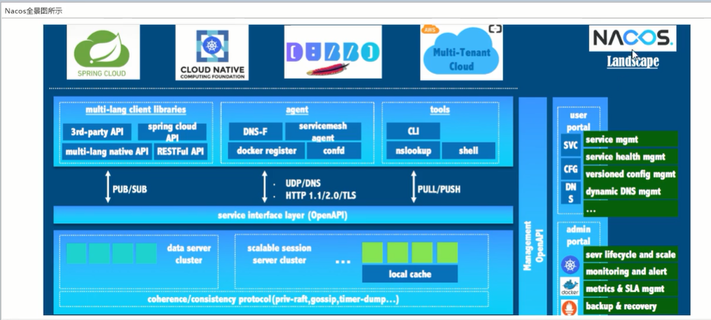

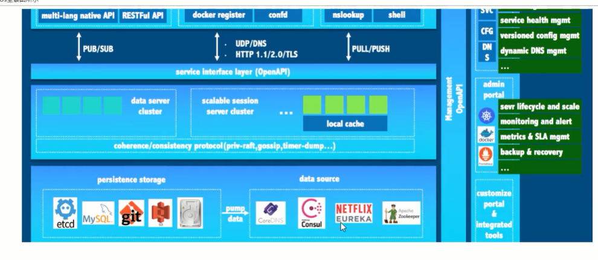

nacos的野心：它想全景覆盖

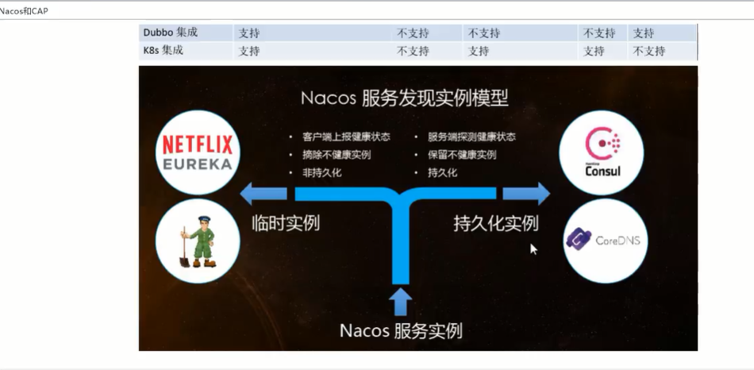


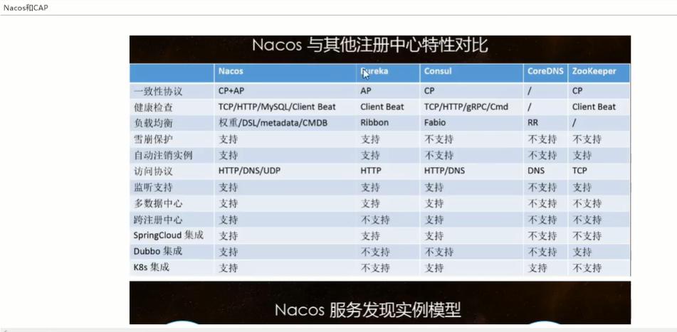


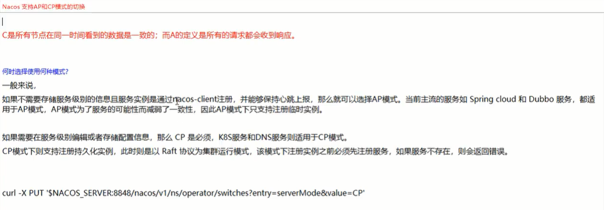

用post命令切换并启动

# 作为服务配置中心

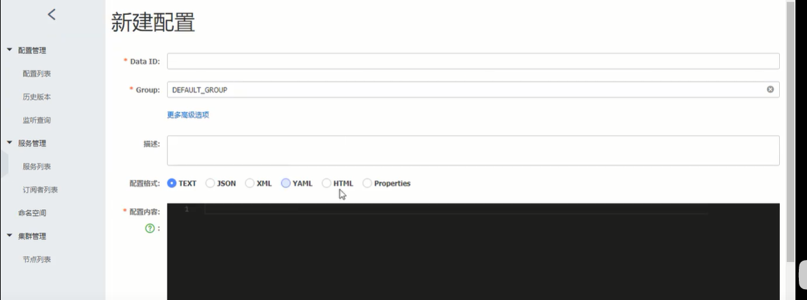


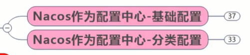


## 作为配置中心-基础配置

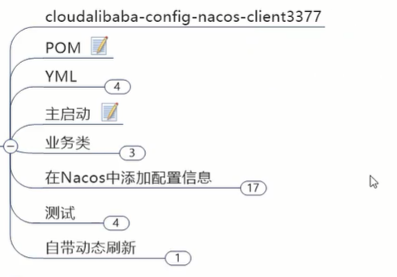

```xml
<!--nacos config-->
<dependency>
    <groupId>com.alibaba.cloud</groupId>
    <artifactId>spring-cloud-starter-alibaba-nacos-config</artifactId>
</dependency>
<!--nacos discovery-->
<dependency>
    <groupId>com.alibaba.cloud</groupId>
    <artifactId>spring-cloud-starter-alibaba-nacos-discovery</artifactId>
</dependency>
```


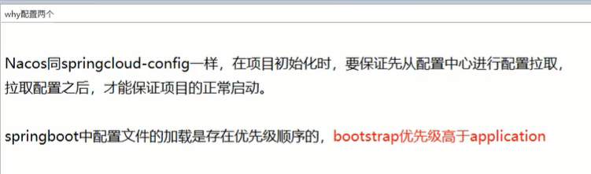


bootstrap.yml:

```yml
server:
  port: 3377

spring:
  application:
    name: nacos-config-client
  cloud:
    nacos:
      discovery:
        server-addr: localhost:8848  #Nacos服务注册中心的地址
      config:
        server-addr: localhost:8848  #Nacos作为配置中心的地址
        file-extension: yaml  #配置文件的格式

#${spring.application.name}-${spring.profile.active}.${spring.cloud.nacos.file-extension}
```


application.yml:

```yml
spring:
  profiles:
    active: dev  #表示开发环境
```


```java
@EnableDiscoveryClient
@SpringBootApplication
public class NacosConfigClientMain3377 {
    public static void main(String[] args) {
        SpringApplication.run(NacosConfigClientMain3377.class,args);
    }
}
```


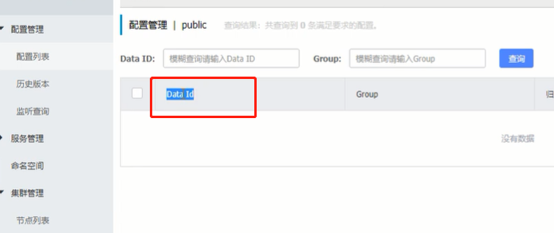

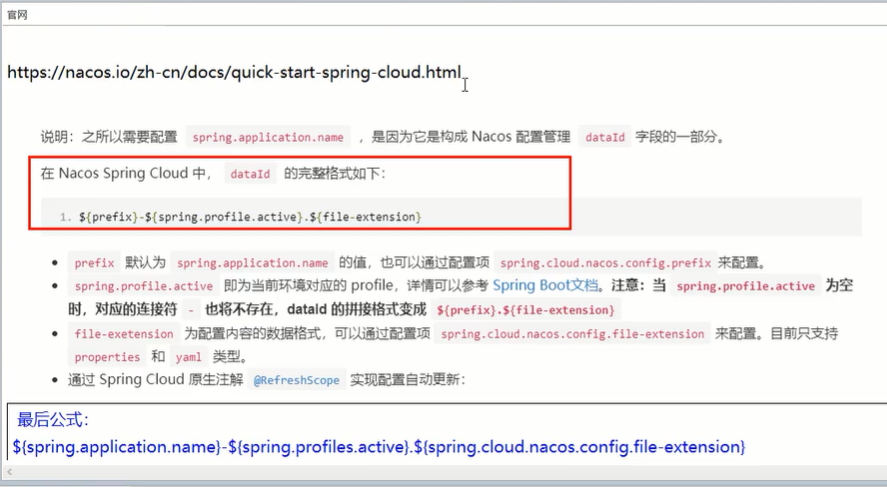


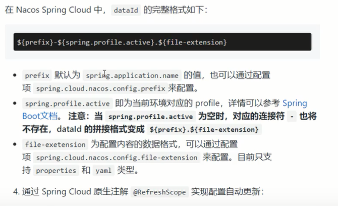


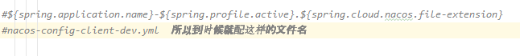


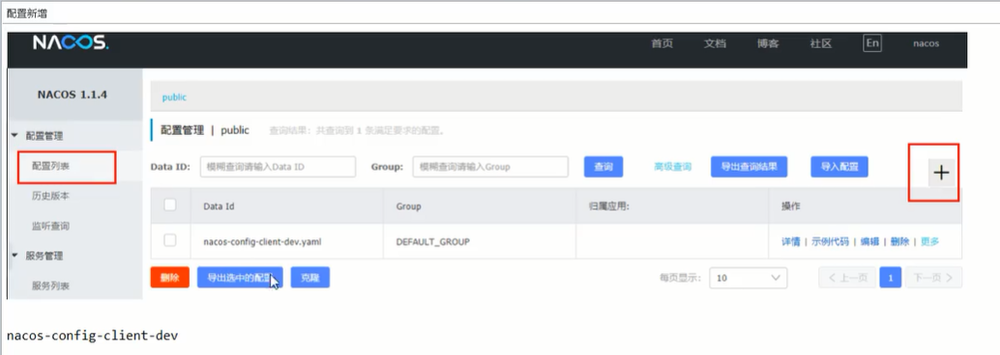


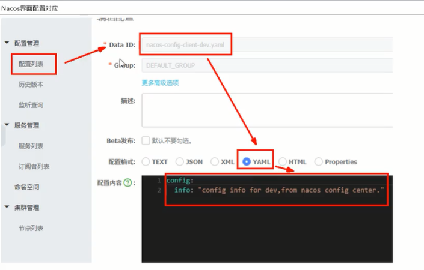

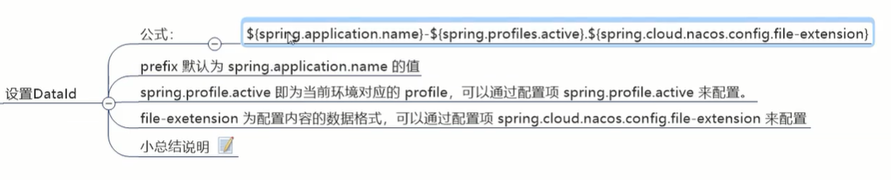

#测试


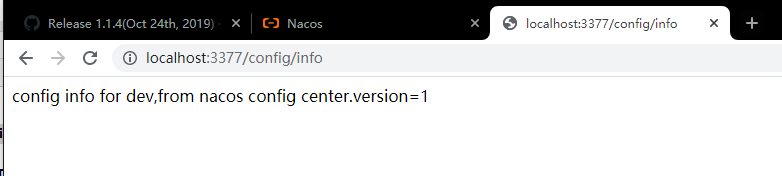


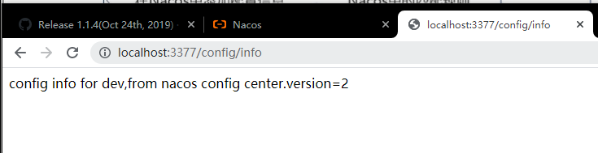

好方便啊！！！


## 作为配置中心-分类配置

这里是nacos分类管理厉害的地方

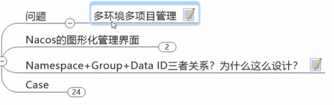

#问题

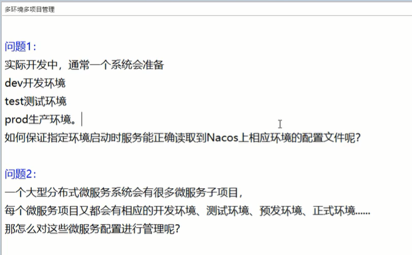

#nacos的图形化管理界面


##配置管理

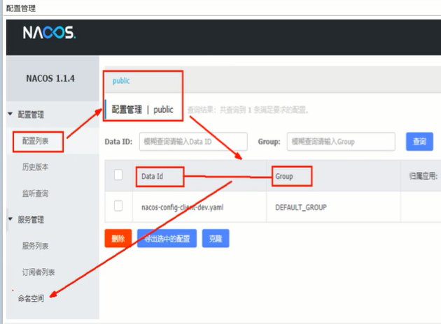

##命名空间

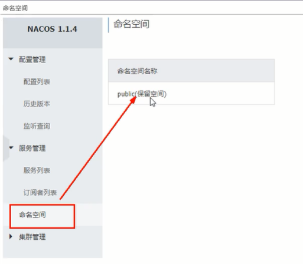


#命名空间+分组+dataid的关系，为什么这样设计

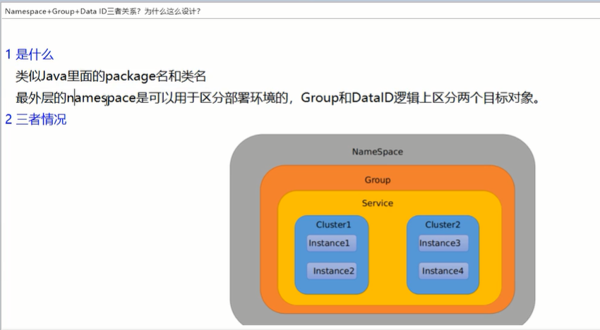


(图里service是微服务，cluster是集群)

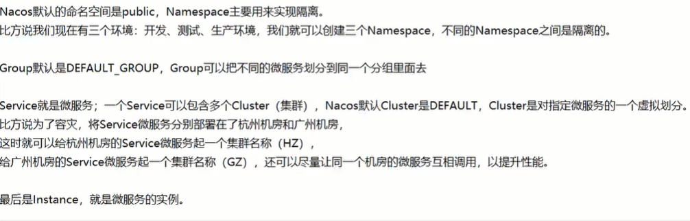


#进行分类配置


##dataid方案


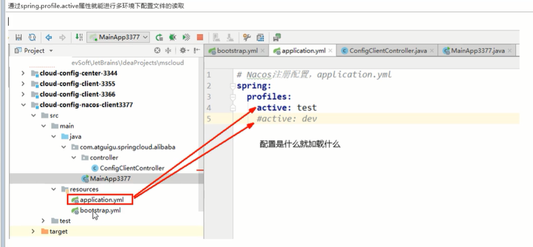


##group方案


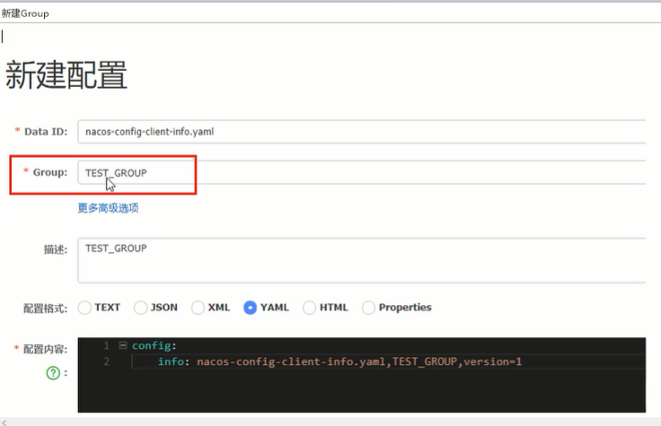

让不同组有同一个文件：

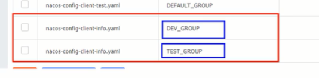


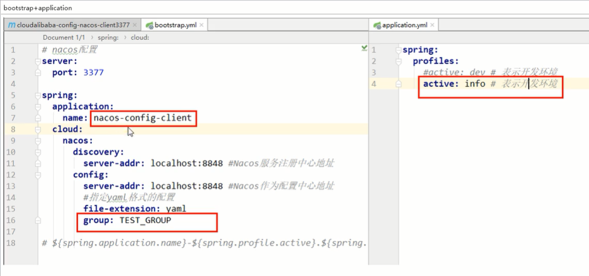

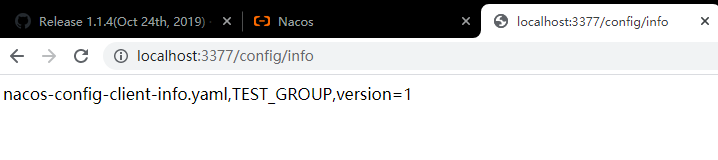

测试成功


##namespace方案


测试成功

三级工作空间，请大家在工作中务必使用


# 集群和持久化配置


如果不配持久，实际生产中会给你惹事的


## 官网说明


(VIP:虚拟映射ip，就nginx)

#真实情况


nacos有内嵌数据库，所以如果启动多个nacos节点，数据存储有一致性问题。

所以采用集中式存储


## 持久化配置解释


#

这个是nacos代码：


可以看到用的是apache的derby


#


测试成功


## linux版nacos+mysql生产环境配置


#nacos下载linux版


很简单


#集群配置


##1


##2


【一般动之前先备份成backup      cp xxxx.xx   xxxx.xx.bk】


##3


梳理一下集群端口号


##4


不要害怕，一点点改


##5


启动：


##6


老子的服务器1个nacos也跑不起来


#测试


#高可用小总结


