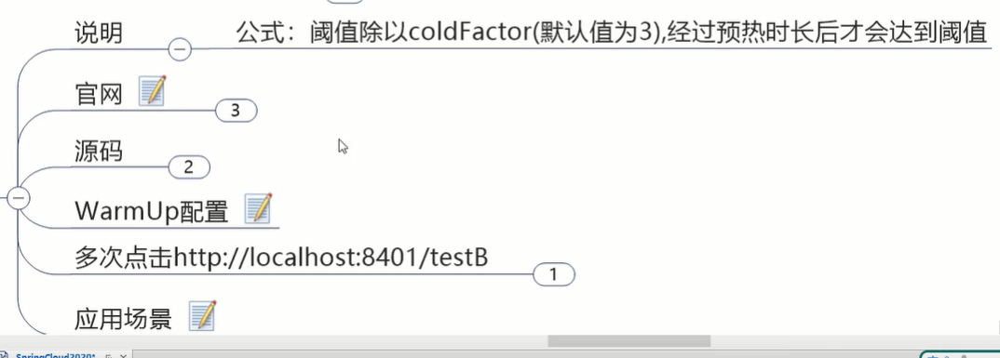
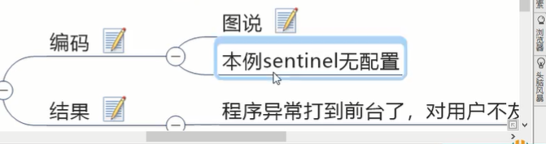
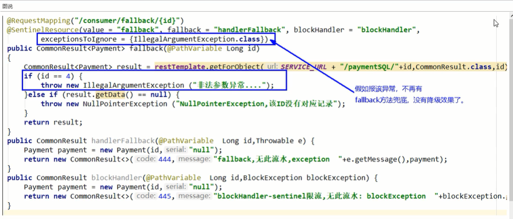

# sentinel


## 官网


就是豪猪哥的阿里版：


但是实质上，理念是一样的，后者抄前面的作业

现在学sentinel，你会发现，关键都是些配置类的事情，上手用来实战


## 是什么


等容灾服务


## 去哪下


## 能干吗


## 怎么玩


# 安装sentinel控制台


# 初始化演示工程


## 启动nacos和sentinel

## module


```xml
<dependencies>
    <!--SpringCloud alibaba nacos-->
    <dependency>
        <groupId>com.alibaba.cloud</groupId>
        <artifactId>spring-cloud-starter-alibaba-nacos-discovery</artifactId>
    </dependency>
    <!--SpringCloud alibaba sentinel-datasource-nacos 后续做持久化用到-->
    <dependency>
        <groupId>com.alibaba.csp</groupId>
        <artifactId>sentinel-datasource-nacos</artifactId>
    </dependency>
    <!--SpringCloud alibaba sentinel-->
    <dependency>
        <groupId>com.alibaba.cloud</groupId>
        <artifactId>spring-cloud-starter-alibaba-sentinel</artifactId>
    </dependency>
    <!--openfeign-->
    <dependency>
        <groupId>org.springframework.cloud</groupId>
        <artifactId>spring-cloud-starter-openfeign</artifactId>
    </dependency>

    <dependency>
        <groupId>com.atguigu.springcloud</groupId>
        <artifactId>cloud-api-commons</artifactId>
        <version>${project.version}</version>
    </dependency>
    <dependency>
        <groupId>org.springframework.boot</groupId>
        <artifactId>spring-boot-starter-web</artifactId>
    </dependency>
    <dependency>
        <groupId>org.springframework.boot</groupId>
        <artifactId>spring-boot-starter-actuator</artifactId>
    </dependency>
    <dependency>
        <groupId>org.springframework.boot</groupId>
        <artifactId>spring-boot-devtools</artifactId>
        <scope>runtime</scope>
        <optional>true</optional>
    </dependency>
    <dependency>
        <groupId>org.projectlombok</groupId>
        <artifactId>lombok</artifactId>
        <optional>true</optional>
    </dependency>
    <dependency>
        <groupId>org.springframework.boot</groupId>
        <artifactId>spring-boot-starter-test</artifactId>
        <scope>test</scope>
    </dependency>
</dependencies>
```


```yml
server:
  port: 8401

spring:
  application:
    name: cloudalibaba-sentinel-service
  cloud:
    nacos:
      discovery:
        server-addr: localhost:8848  #nacos服务注册中心地址
    sentinel:
      transport:
        dashboard: localhost:8080  #配置sentinel dashboard地址
        port: 8719  #默认8719端口，假如被占用会自动从8719开似乎依次+1扫描，直至找到未被占用的端口


#图形化展示需要暴露的点
management:
  endpoints:
    web:
      exposure:
        include: '*'
```


```java
@SpringBootApplication
@EnableDiscoveryClient
public class MainApp8401 {
    public static void main(String[] args) {
        SpringApplication.run(MainApp8401.class,args);
    }
}
```


```java
@RestController
public class FlowLimitController {

    @GetMapping("/testA")
    public String testA(){
        return "-----testA";
    }

    @GetMapping("/testB")
    public String testB(){
        return "-----testB";
    }
}
```


## 启动sentinel8080


## 查看sentinel控制台


# 流控规则


## 基本介绍


资源名：唯一的rest风格的流量入口

## 流控模式


在控制台可以在簇点链路加流控，或者在流控规则加


当流量超过配置的阈值，就会被sentinel限流


### 直接(默认)

-->api达到限流条件时，直接限流


限制线程数，跟请求每秒区别是，请求都放进来，只有指定线程数量去处理，能处理的就处理了，不能处理就拦住

给控制器方法加sleep，就能看出限制线程数的流控效果


### 关联

-->当关联的资源达到阈值时，就限流自己

别人惹事，我自己买单


如支付接口达到阈值，就限流下订单接口，防止连坐效应


如图，B惹事将导致A挂


postman的collections 多次并发访问。把请求保存在collection


设置迭代次数和延时

点发送后，A被直接限流：


等20个请求结束，qps下来了，A又恢复正常


### 链路

-->


## 流控效果


### 直接


### 预热



#官网


如：


希望你单机阈值是**10**，那么开始时10/3(冷加载因子)=3是开始的阈值，给你**5秒**从3过渡到10


#源码


#warmup配置


#


点快了刚开始会报错，慢慢的(5秒)就扛得住了


#应用场景


### 排队等待

大家去大学食堂打饭，一般都是排成一条直线，匀速通过


我设了限流规则，只允许挨个处理，比如你1秒塞进100个请求，营业员比较佛系，每秒只处理一个，不管你高不高兴，总之我对我自己系统进行一个保护。能耐就是1秒处理一个，你愿意等就等，不愿等就超时重试


别到时候忙的忙死闲的闲死

用postman或jmeter压测


你既没有把我冲垮，我也没有把你拒绝


# 降级规则


## 基本介绍


## 降级策略实战


### RT


#是什么


#测试

##代码

```java
//测试降级的RT(平均响应时间)
public String testD() {
    try{
        TimeUnit.SECONDS.sleep(1);
    }catch (InterruptedException e){
        e.printStackTrace();
    }
    log.info("testD 测试RT");
    return "------testD";
}
```

##配置


##压测

1秒打10(大于官网的另一个要求，**5**个)个

配的是平均响应时间小于0.2秒，但处理时间是1秒，所以肯定降级

##结论


### 异常比例


这样是100％异常


这样会熔断降级

如果关闭压测，因为不满足qps>=5，不会熔断降级直接报错：


### 异常数


# 热点key限流


## 基本介绍


## 承上启下复习


## 代码


```java
//测试热点限流
@GetMapping("/testHotKey")
@SentinelResource(value = "testHotKey",blockHandler = "deal_testHotKey")
public String testHotKey(@RequestParam(value = "p1",required = false)String p1,
                         @RequestParam(value = "p2",required = false)String p2){
    return "-----------testHotKey";
}
public String deal_testHotKey(String p1, String p2, BlockException exception){
    return "------------deal_testHotKey";//sentinel系统默认的提示：Blocked by Sentinel(flow limiting)
}
```

新注解@SentinelResource就是对sentinel控制台负责，  value是唯一名字，如果控制台配的规则违背了，就去blockHandler兜底方法


## 配置


## 测试


## 参数例外项


### 特例情况


### 配置


### 测试


### 前提条件


## 其它


人家@SentinelResource管的只是控制台出的错，配置出的错兜底


# 系统规则


## 是什么


之前的流量控制都是具体到细粒度，现在想从整体维度对应用入口的流量做控制

## 各项配置参数说明

5个支持的模式来给整个系统做限流：


## 配置全局qps

很简单

这样全局配置还是比较危险


# @SentinelResource


## 按资源名称限流+后续处理

按资源名称，就是按照value = "byResource"


pom就把我们common引进去

yml没动

```java
@RestController
public class RateLimitController {

    @GetMapping("/byResource")
    @SentinelResource(value = "byResource",blockHandler = "handleException")
    public CommonResult byResource(){
        return new CommonResult(200,"按资源名称限流测试OK",new Payment(2020L,"serial001"));
    }

    public CommonResult handleException(BlockException exception){
        return new CommonResult(444,exception.getClass().getCanonicalName()+"\t 服务不可用");
    }
}
```


这种之前已经使用过


消失了，是临时的流控规则

## 按url地址限流+后续处理


```java
//按url限流
@GetMapping("/rateLimit/byUrl")
@SentinelResource(value = "byUrl")
public CommonResult byUrl(){
    return new CommonResult(200,"按url限流测试OK",new Payment(2020L,"serial002"));
}
```


## 上面兜底方案面临的问题


## 客户自定义限流处理逻辑


```java
//降低耦合
    @GetMapping("/rateLimit/customerBlockHandler")
    @SentinelResource(value = "customerBlockHandler",blockHandlerClass = CustomerBlockHandler.class,blockHandler = "handlerException2")
    public CommonResult customerBlockHandler(){
        return new CommonResult(200,"按客户自定义",new Payment(2020L,"serial003"));
    }
```


```java
public class CustomerBlockHandler {
    public CommonResult handlerException(BlockException exception){
        return new CommonResult(4444,"按客户自定义,global,handlerException------1");
    }

    public CommonResult handlerException2(BlockException exception){
        return new CommonResult(4444,"按客户自定义,global,handlerException-------2");
    }
}
```

#


#


## 更多注解属性说明


这api是用代码配置，不太推荐


# 服务熔断功能


## Ribbon系列


### 环境

#提供者


```xml
<dependencies>
    <!--SpringCloud alibaba nacos-->
    <dependency>
        <groupId>com.alibaba.cloud</groupId>
        <artifactId>spring-cloud-starter-alibaba-nacos-discovery</artifactId>
    </dependency>
    <dependency>
        <groupId>com.atguigu.springcloud</groupId>
        <artifactId>cloud-api-commons</artifactId>
        <version>${project.version}</version>
    </dependency>
    <dependency>
        <groupId>org.springframework.boot</groupId>
        <artifactId>spring-boot-starter-web</artifactId>
    </dependency>
    <dependency>
        <groupId>org.springframework.boot</groupId>
        <artifactId>spring-boot-starter-actuator</artifactId>
    </dependency>
    <dependency>
        <groupId>org.springframework.boot</groupId>
        <artifactId>spring-boot-devtools</artifactId>
        <scope>runtime</scope>
        <optional>true</optional>
    </dependency>
    <dependency>
        <groupId>org.projectlombok</groupId>
        <artifactId>lombok</artifactId>
        <optional>true</optional>
    </dependency>
    <dependency>
        <groupId>org.springframework.boot</groupId>
        <artifactId>spring-boot-starter-test</artifactId>
        <scope>test</scope>
    </dependency>
</dependencies>
```


```yml
server:
  port: 9003

spring:
  application:
    name: nacos-payment-provider
  cloud:
    nacos:
      discovery:
        server-addr: localhost:8848  #nacos地址

management:
  endpoints:
    web:
      exposure:
        include: '*'
```


```java
@RestController
public class PaymentController {
    @Value("${server.port}")
    private String serverPort;
    
    public static HashMap<Long, Payment> hashMap = new HashMap<>();
    static{
        hashMap.put(1L,new Payment(1L,"序列号1"));
        hashMap.put(2L,new Payment(2L,"序列号2"));
        hashMap.put(3L,new Payment(3L,"序列号3"));
    }
    
    @GetMapping(value = "/paymentSQL/{id}")
    public CommonResult<Payment> paymentSQL(@PathVariable("id")Long id){
        Payment payment =  hashMap.get(id);
        return new CommonResult<>(200,"from mysql,serverPort: "+serverPort,payment);
    }
    
}
```


#消费者


### controller的编写-没有任何配置


```java
@RestController
@Slf4j
public class CirclieBreakerController {

    public static final String SERVICE_URL = "http://nacos-payment-provider";

    @Resource
    private RestTemplate restTemplate;

    @RequestMapping("/consumer/fallback/{id}")
    @SentinelResource(value = "fallback")//没有配置
    public CommonResult<Payment> fallback(@PathVariable Long id){
        CommonResult<Payment> result = restTemplate.getForObject(SERVICE_URL+"/paymentSQL/1"+id,CommonResult.class,id);

        if(id==4){
            throw new IllegalArgumentException("IllegalArgumentException，非法参数异常...");
        }else if(result.getData()==null){
            throw new NullPointerException("NullPointerException，该id没有对应记录，空指针异常...");
        }

        return result;
    }

}
```


测试成功


### 只配fallback

```java
@SentinelResource(value = "fallback",fallback = "handlerFallback") //fallback只负责业务异常
```

```java
//本例是fallback
public CommonResult handlerFallback(@PathVariable Long id,Throwable e){
    Payment payment = new Payment(id,"null");
    return new CommonResult(444,"兜底异常handlerFallback,exception内容："+e.getMessage(),payment);
}
```


### 只配blockHandler

```java
@SentinelResource(value = "fallback",blockHandler = "blockHandler") //blockHandler只负责sentinel控制台配置违规
```

```java
//本例是blockHandler
public CommonResult blockHandler(@PathVariable Long id, BlockException blockException){
    Payment payment = new Payment(id,"null");
    return new CommonResult(445,"blockHandler-sentinel限流，无此流水：blockException:"+blockException.getMessage(),payment);
}
```

### fallback和blockHandler都配

```java
@SentinelResource(value = "fallback",fallback = "handlerFallback",blockHandler = "blockHandler")
```

同时起效呗，各回各家

如果狂访问，又异常又要限流，则是到限流


### 忽略属性






```java
@SentinelResource(value = "fallback",fallback = "handlerFallback",blockHandler = "blockHandler",
        exceptionsToIgnore = {IllegalArgumentException.class})   
```


sentinel的fallback和blockHandler一起配很好，是双剑合璧


## Feign系列

微服务调用也就是dubbo那样的rpc，微服务调用要么用ribbon要么用feign


```java
@FeignClient(value = "nacos-payment-provider",fallback = PaymentFallbackService.class)
public interface PaymentService {

    @GetMapping(value = "/paymentSQL/{id}")
    public CommonResult<Payment> paymentSQL(@PathVariable("id")Long id);

}
```

```java
@Component
public class PaymentFallbackService implements PaymentService {
    @Override
    public CommonResult<Payment> paymentSQL(Long id) {
        return new CommonResult<>(444444,"服务降级返回,PaymentFallbackService",new Payment(id,"errorSeral"));
    }
}
```

```java
@GetMapping(value = "/consumer/paymentSQL/{id}")
public CommonResult<Payment> paymentSQL(@PathVariable("id")Long id){
    return paymentService.paymentSQL(id);
}
```


## 熔断框架比较


# 规则持久化


之前配进sentinel的规则，微服务一重启就消失了

上生产以后，一堆配置


```xml
<!--SpringCloud alibaba sentinel-datasource-nacos-->
<dependency>
    <groupId>com.alibaba.csp</groupId>
    <artifactId>sentinel-datasource-nacos</artifactId>
</dependency>
```


