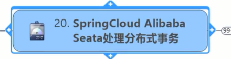

同学不容易，跟着阳哥杀到了第20章

你做过的项目的技术架构，基于分布式的微服务架构，百分百问你们分布式事务怎么控制的。因为只要说到分布式，不可能你的数据库只有一个，

现在来看多数据库多数据源你们的事务是怎么控制的

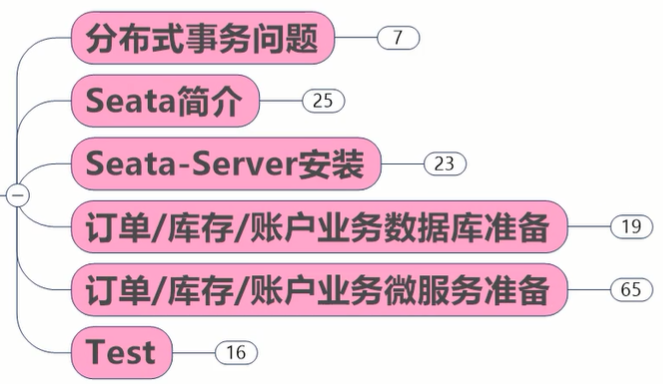


# 分布式事务问题

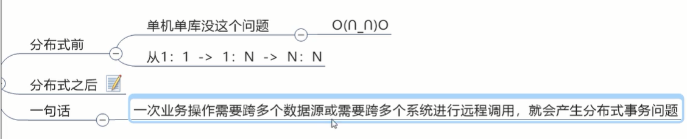

服务对数据源的变化：

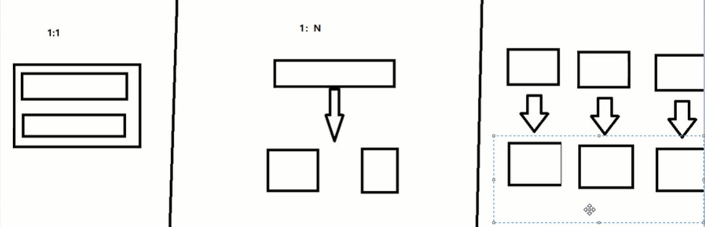

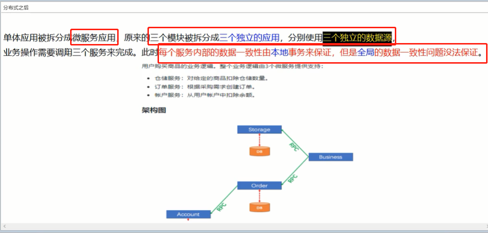

全局一致性：三个一起成功失败

现在就是要解决全局的数据一致性问题


# seata简介

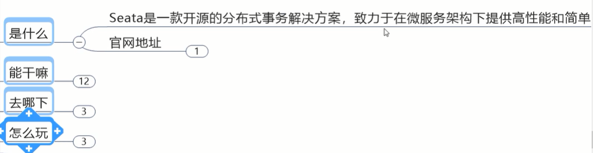


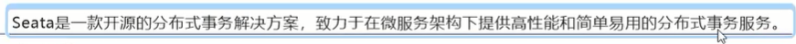


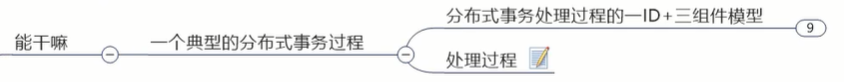


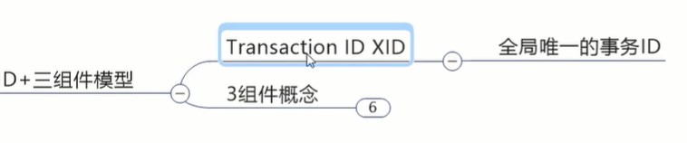

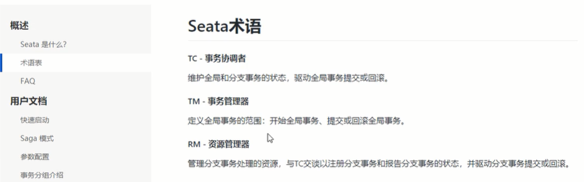

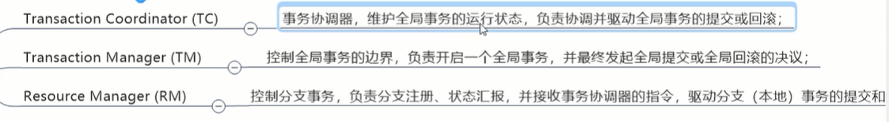


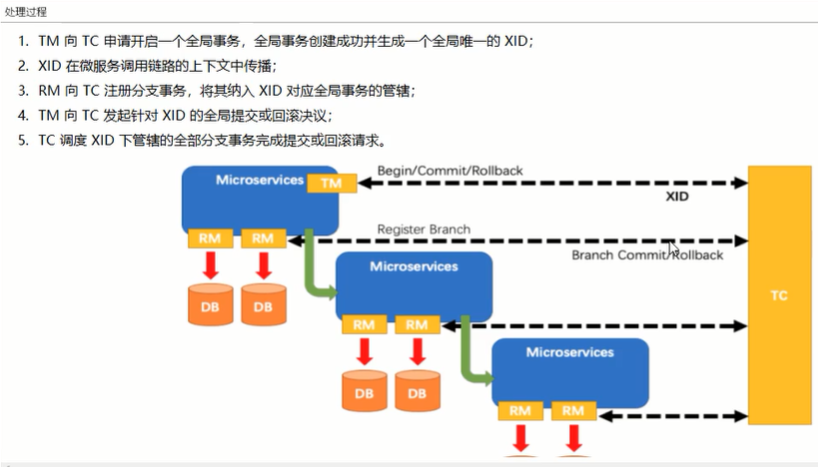


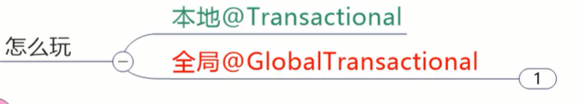


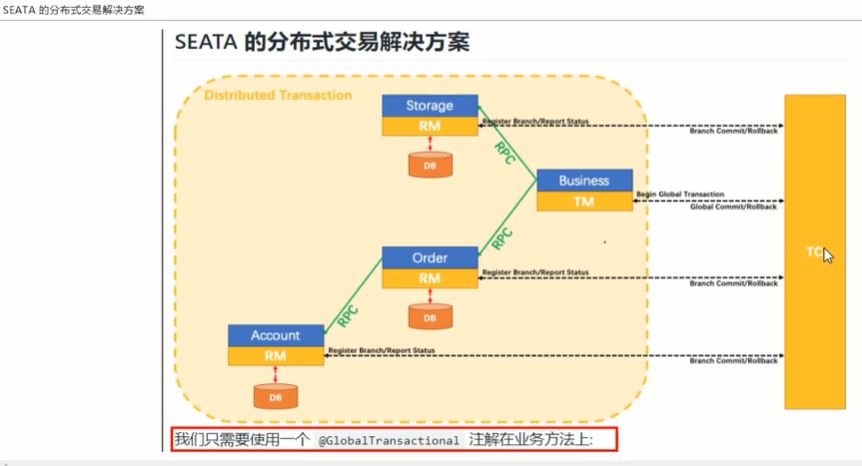

越是简单使用的东西底层越啰嗦越复杂


# seata-server安装

阳哥三板斧，理论 实操 小总结

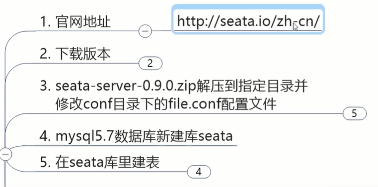

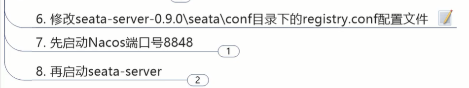

#

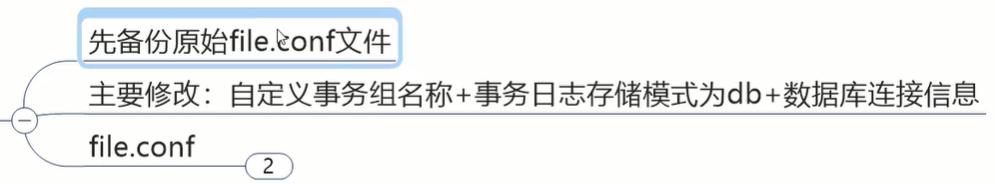


自定义事务组名称：


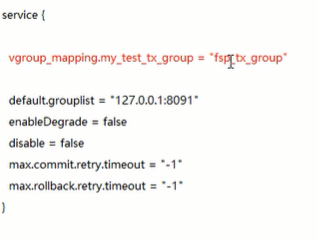

名字是随便起的


事务日志存储模式：默认是文件，改成数据库

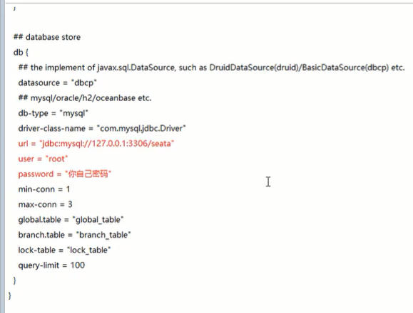

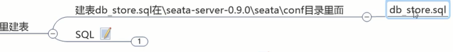


#

配置注册到哪

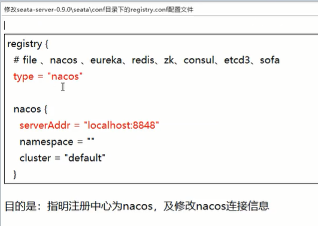

#

启动nacos

启动seata


你可以把seata就看成一个分布式事务服务器

阿里这个设计思想，就像，尽量的跟主业务剥离出来


# 订单-库存-账户 数据库准备

先把三块数据库准备好，勿在浮沙之上筑高台

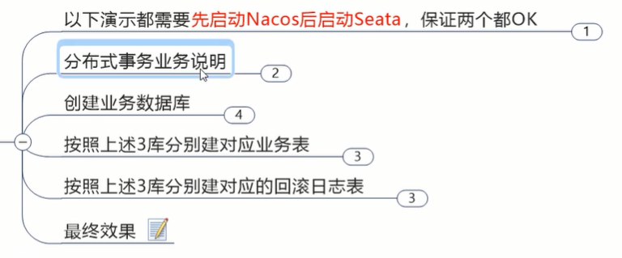

#业务说明

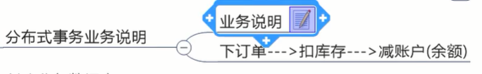

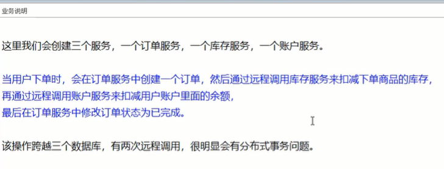

#创建业务数据库

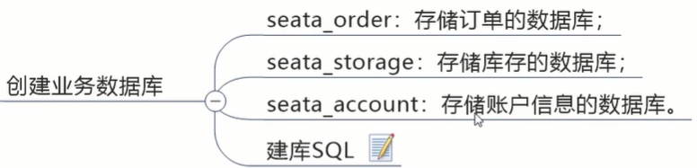

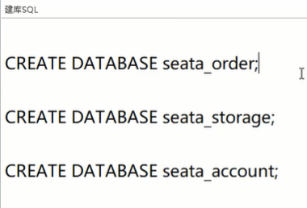

#建业务表

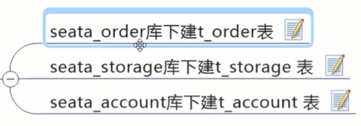

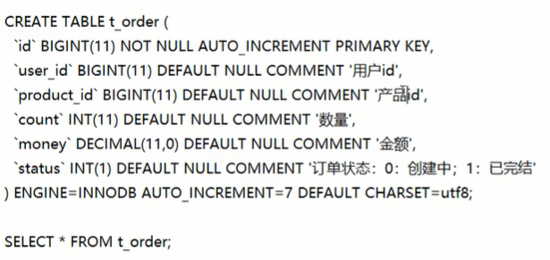


CREATE DATABASE seata_order;
USE seata_order;
CREATE TABLE t_order(
    id BIGINT(11) NOT NULL AUTO_INCREMENT PRIMARY KEY ,
    user_id BIGINT(11) DEFAULT NULL COMMENT '用户id',
    product_id BIGINT(11) DEFAULT NULL COMMENT '产品id',
    count INT(11) DEFAULT NULL COMMENT '数量',
    money DECIMAL(11,0) DEFAULT NULL COMMENT '金额',
    status INT(1) DEFAULT NULL COMMENT '订单状态：0创建中，1已完结'
)ENGINE=InnoDB AUTO_INCREMENT=7 CHARSET=utf8;


CREATE DATABASE seata_storage;
USE seata_storage;
CREATE TABLE t_storage(
    id BIGINT(11) NOT NULL AUTO_INCREMENT PRIMARY KEY ,
    product_id BIGINT(11) DEFAULT NULL COMMENT '产品id',
    total INT(11) DEFAULT NULL COMMENT '总库存',
    used INT(11) DEFAULT NULL COMMENT '已用库存',
    residue INT(11) DEFAULT NULL COMMENT '剩余库存'
)ENGINE=InnoDB AUTO_INCREMENT=7 CHARSET=utf8;
INSERT INTO t_storage(id, product_id, total, used, residue) VALUES(1,1,100,0,100);


CREATE DATABASE seata_account;
USE seata_account;
CREATE TABLE t_account(
    id BIGINT(11) NOT NULL AUTO_INCREMENT PRIMARY KEY ,
    user_id BIGINT(11) DEFAULT NULL COMMENT '用户id',
    total DECIMAL(10,0) DEFAULT NULL COMMENT '总额度',
    used DECIMAL(10,0) DEFAULT NULL COMMENT '已用额度',
    residue DECIMAL(10,0) DEFAULT 0 COMMENT '剩余可用额度'
)ENGINE=InnoDB AUTO_INCREMENT=7 CHARSET=utf8;
INSERT INTO t_account(id, user_id, total, used, residue) VALUES(1,1,1000,0,1000);


#对应的回滚日志表

需要通过回滚日志来组织事务

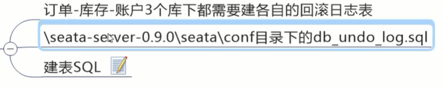

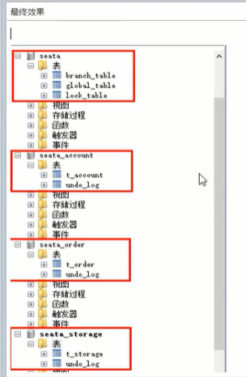


# 订单-库存-账户 微服务准备

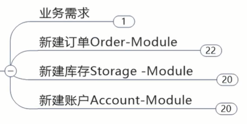


## 订单模块

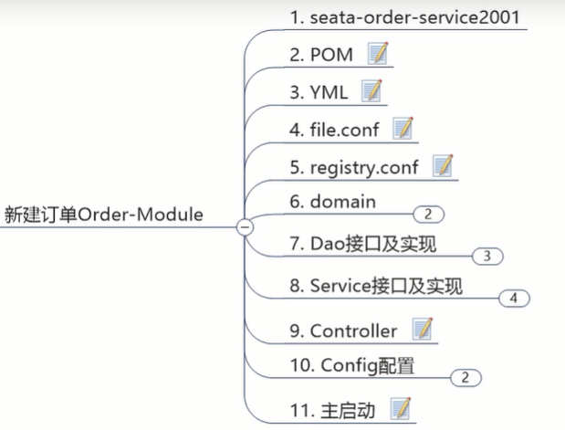


pom用全套alibaba

```xml
<dependencies>
    <!--seata-->
    <dependency>
        <groupId>com.alibaba.cloud</groupId>
        <artifactId>spring-cloud-starter-alibaba-seata</artifactId>
        <exclusions>
            <exclusion>
                <artifactId>seata-all</artifactId>
                <groupId>io.seata</groupId>
            </exclusion>
        </exclusions>
    </dependency>
    <dependency>
        <groupId>io.seata</groupId>
        <artifactId>seata-all</artifactId>
        <version>0.9.0</version>
    </dependency>
    <!--SpringCloud alibaba nacos-->
    <dependency>
        <groupId>com.alibaba.cloud</groupId>
        <artifactId>spring-cloud-starter-alibaba-nacos-discovery</artifactId>
    </dependency>
    <!--openfeign-->
    <dependency>
        <groupId>org.springframework.cloud</groupId>
        <artifactId>spring-cloud-starter-openfeign</artifactId>
    </dependency>

    <dependency>
        <groupId>com.atguigu.springcloud</groupId>
        <artifactId>cloud-api-commons</artifactId>
        <version>${project.version}</version>
    </dependency>
    <dependency>
        <groupId>org.springframework.boot</groupId>
        <artifactId>spring-boot-starter-web</artifactId>
    </dependency>
    <dependency>
        <groupId>org.springframework.boot</groupId>
        <artifactId>spring-boot-starter-actuator</artifactId>
    </dependency>
    <dependency>
        <groupId>org.springframework.boot</groupId>
        <artifactId>spring-boot-devtools</artifactId>
        <scope>runtime</scope>
        <optional>true</optional>
    </dependency>
    <dependency>
        <groupId>org.projectlombok</groupId>
        <artifactId>lombok</artifactId>
        <optional>true</optional>
    </dependency>
    <dependency>
        <groupId>org.springframework.boot</groupId>
        <artifactId>spring-boot-starter-test</artifactId>
        <scope>test</scope>
    </dependency>
    <dependency>
        <groupId>mysql</groupId>
        <artifactId>mysql-connector-java</artifactId>
    </dependency>
    <dependency>
        <groupId>org.springframework.boot</groupId>
        <artifactId>spring-boot-starter-jdbc</artifactId>
    </dependency>
</dependencies>
```


yml

```yml
server:
  port: 2001

spring:
  application:
    name: seata-order-service
  cloud:
    alibaba:
      seata:
        #自定义事务组名，要与seata-server中的对应
        tx-service-group: fsp_tx_group
    nacos:
      discovery:
        server-addr: localhost:8848
  datasource:
    type: com.alibaba.druid.pool.DruidDataSource
    driver-class-name: org.gjt.mm.mysql.Driver
    url: jdbc:mysql://localhost:3306/seata_order?useUnicode=true&characterEncoding=utf-8&useSSL=false
    username: root
    password: root
    
    
feign:
  hystrix:
    enabled: false
    
    
logging:
  level:
    io:
      seata: info
      
      
mybatis:
  mapper-locations: classpath:mapper/*.xml
```


file.conf

把seata原有的拷贝来，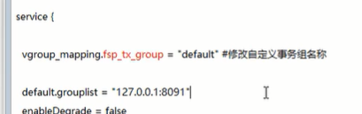


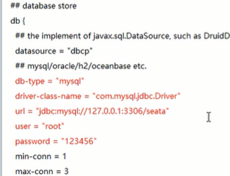

注意seata那边是总控的


registry.conf

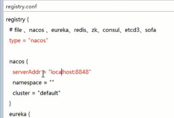


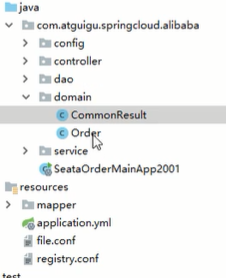

domain:

```java
@Data
@AllArgsConstructor
@NoArgsConstructor
public class CommonResult<T> {
    private Integer code;
    private String message;
    private T data;

    public CommonResult(Integer code,String message){
        this(code,message,null);
    }
}
```


```java
@Data
@AllArgsConstructor
@NoArgsConstructor
public class Order {
    private Long id;
    private Long userId;
    private Long productId;
    private Integer count;
    private BigDecimal money;
    private Integer status;//订单状态:0 创建中；1 已完结
}
```


dao

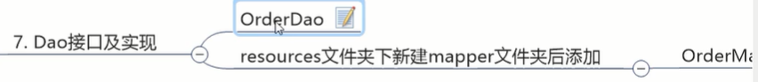


```java
@Mapper
public interface OrderDao {

    //新建订单
    void create(Order order);

    //修改订单状态，从0到1
    void update(@Param("userId")Long userId,@Param("status")Integer status);

}
```

```xml
<?xml version="1.0" encoding="UTF-8"?>
<!DOCTYPE mapper PUBLIC "-//mybatis.org//DTD Mapper 3.0//EN" "http://mybatis.org/dtd/mybatis-3-mapper.dtd">

<mapper namespace="com.atguigu.springcloud.alibaba.dao.OrderDao">
    <resultMap id="BaseResultMap" type="com.atguigu.springcloud.alibaba.domain.Order">
        <id column="id" property="id" jdbcType="BIGINT"/>
        <result column="user_id" property="userId" jdbcType="BIGINT"/>
        <result column="product_id" property="productId" jdbcType="BIGINT"/>
        <result column="count" property="count" jdbcType="INTEGER"/>
        <result column="money" property="money" jdbcType="DECIMAL"/>
        <result column="status" property="status" jdbcType="INTEGER"/>
    </resultMap>


    <insert id="create">
        insert into t_order(id,user_id,product_id,count,money,status)
        values (null,#{userId},#{productId},#{count},#{money},0);
    </insert>

    <update id="update">
        update t_order set status=1 where user_id=#{userId} and status = #{status};
    </update>

</mapper>
```


service

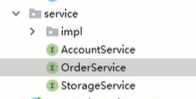


```java
@FeignClient(value="seata-account-service")
public interface AccountService {

    @PostMapping(value = "/account/decrease")
    CommonResult decrease(@RequestParam("userId")Long userId, @RequestParam("money") BigDecimal money);

}
```

```java
@FeignClient(value="seata-storage-service")
public interface StorageService {

    @PostMapping(value = "/storage/decrease")
    CommonResult decrease(@RequestParam("productId")Long productId,@RequestParam("count")Integer count);

}
```

```java
public interface OrderService {
    void create(Order order);
}
```


```java
@Service
@Slf4j
public class OrderServiceImpl implements OrderService {
    @Resource
    private OrderDao orderDao;
    @Resource
    private StorageService storageService;
    @Resource
    private AccountService accountService;

    @Override
    public void create(Order order) {
        log.info("----->开始新建订单");
        orderDao.create(order);

        log.info("----->订单微服务开始调用库存，做扣减Count");
        storageService.decrease(order.getProductId(),order.getCount());
        log.info("----->订单微服务开始调用库存，做扣减end");


        log.info("----->订单微服务开始调用账户，做扣减Money");
        accountService.decrease(order.getProductId(),order.getMoney());
        log.info("----->订单微服务开始调用账户，做扣减end");

        log.info("----->修改订单状态开始");
        orderDao.update(order.getUserId(),0);

        log.info("----->下订单结束了");
    }
}
```


controller

```java
@RestController
public class OrderController {
    @Resource
    private OrderService orderService;

    @GetMapping("/order/create")
    public CommonResult create(Order order){
        orderService.create(order);
        return new CommonResult(200,"订单创建成功");
    }
}
```

config


```java
@Configuration
@MapperScan("com.atguigu.springcloud.alibaba.dao") //告诉你dao层跟Mybatis相关
public class MyBatisConfig {
}
```


```java
//数据源的代理
@Configuration
public class DataSourceProxyConfig {
    @Value("${mybatis.mapperLocations}")
    private String mapperLocations;

    @Bean
    @ConfigurationProperties(prefix="spring.datasource")
    public DataSource druidDataSource(){
        return new DruidDataSource();
    }

    @Bean
    public DataSource dataSourceProxy(DataSource dataSource){
        return new DataSourceProxy(dataSource);
    }

    @Bean
    public SqlSessionFactory sqlSessionFactoryBean(DataSourceProxy dataSourceProxy)throws Exception{
        SqlSessionFactoryBean sqlSessionFactoryBean = new SqlSessionFactoryBean();
        sqlSessionFactoryBean.setDataSource(dataSourceProxy);
        sqlSessionFactoryBean.setMapperLocations(new PathMatchingResourcePatternResolver().getResources(mapperLocations));
        sqlSessionFactoryBean.setTransactionFactory(new SpringManagedTransactionFactory());
        return sqlSessionFactoryBean.getObject();

    }

}
```

先起nacos，再起seata，再起2001项目

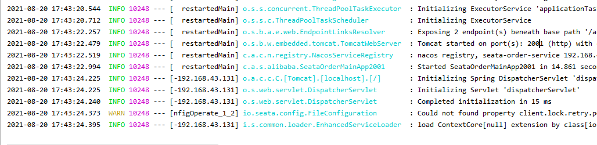

启动成功


## 库存模块

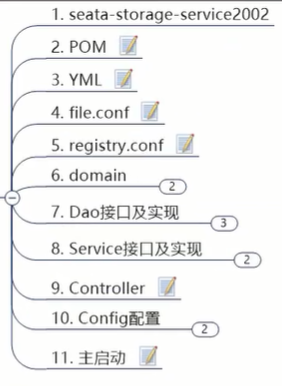

pom一样

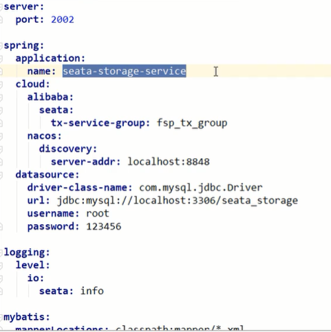

domain

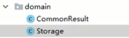

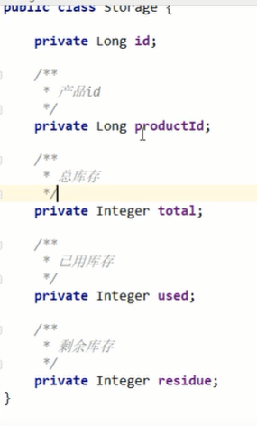


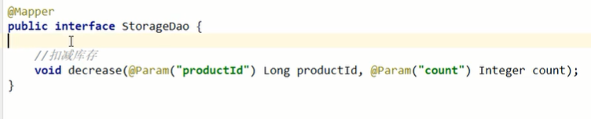

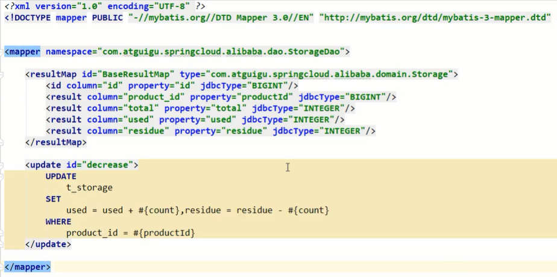


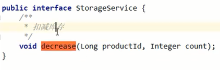

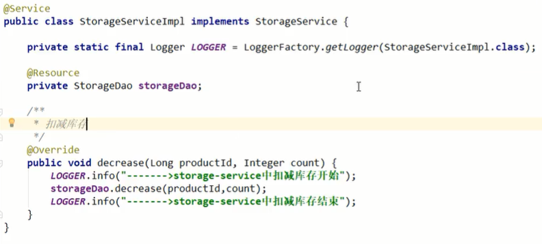

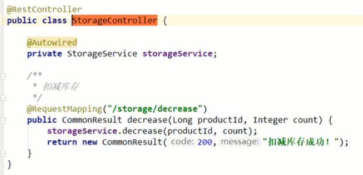


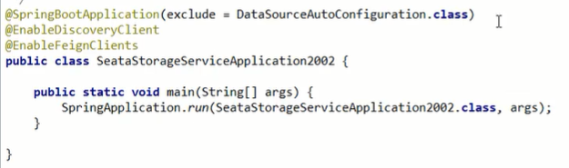


## 账户模块

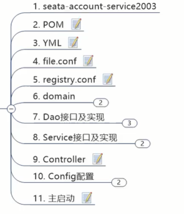


# Test


## 数据库初识情况


## 正常下单


测试成功


## 超时异常，每加全局事务


feign默认调用时间是1秒


如果你不管这个全局，牵扯到的库越多，到后面你修数据的时候越恐怖


## 超时异常，添加全局事务


在2001业务层，事务开始的方法上加


发现出异常了，就回滚，根本就不会提交数据库的写操作！你现在没有错误数据进库

只需要使用一个@GlobalTransactional在业务方法上，就可以解决分布式的 跨数据库的 多个微服务调用间的全局事务控制问题。这是目前工作中的必备技能，务必掌握


tmd！半天半天不管用，只有order回滚。原来是没写数据源代理！


测试成功


# Seata原理简介


## seata


工作后必须用新版本

0.9不支持集群


## TC/TM/RM三大组件


默认用的是AT模式

低侵入自动补偿模式


## AT模式如何做到对业务的无侵入


seata服务器的表

锁表 全局表 


#一阶段加载


保存原快照


#二阶段提交


#二阶段回滚

通过一阶段的回滚日志进行反向补偿


## debug


小本本记着：


锁了三张表


## 补充


代理数据源，去给它aop，做前置通知后置通知，做生成前置快照后置快照等操作


更深入的源码级别的讲解第三季讲

面试中还是要有些说辞和准备

想面试阿里的，说难听点先外包接触项目再找机会转正，关键是平台决定技术

除了会用，尽量的要会说，跟人家理的清楚这些理论

