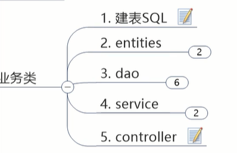

### 支付模块构建

预想：订单模块(端口80)可以去调用支付模块(端口8001)


那么在父工程中创建支付模块和订单模块。


怎么构建一个微服务模块：

1.建module

2.改POM

3.写YML

4.主启动

5.业务类


开工

#微服务提供者支付模块


#改pom

可以看到：


依赖：


这些是boot的东西，web和actuator(图形化显示，坐标监控，图形处理)几乎是永远绑定在一块


```xml
<dependencies>
    <dependency>
        <groupId>org.springframework.boot</groupId>
        <artifactId>spring-boot-starter-web</artifactId>
    </dependency>
    <dependency>
        <groupId>org.springframework.boot</groupId>
        <artifactId>spring-boot-starter-actuator</artifactId>
    </dependency>
    <dependency>
        <groupId>org.mybatis.spring.boot</groupId>
        <artifactId>mybatis-spring-boot-starter</artifactId>
    </dependency>
    <dependency>
        <groupId>com.alibaba</groupId>
        <artifactId>druid-spring-boot-starter</artifactId>
    </dependency>
    <dependency>
        <groupId>mysql</groupId>
        <artifactId>mysql-connector-java</artifactId>
    </dependency>
    <dependency>
        <groupId>org.springframework.boot</groupId>
        <artifactId>spring-boot-starter-jdbc</artifactId>
    </dependency>
    <dependency>
        <groupId>org.springframework.boot</groupId>
        <artifactId>spring-boot-devtools</artifactId>
        <scope>runtime</scope>
        <optional>true</optional>
    </dependency>
    <dependency>
        <groupId>org.projectlombok</groupId>
        <artifactId>lombok</artifactId>
        <optional>true</optional>
    </dependency>
    <dependency>
        <groupId>org.springframework.boot</groupId>
        <artifactId>spring-boot-starter-test</artifactId>
        <scope>test</scope>
    </dependency>
</dependencies>
```


#写yml

微服务一定要有端口号，服务名称


配置直接粘贴


```xml
server:
  port: 8001

spring:
  application:
    name: cloud-payment-service
  datasource:
    type: com.alibaba.druid.pool.DruidDataSource
    driver-class-name: org.gjt.mm.mysql.Driver
    url: jdbc:mysql://localhost:3306/db2019?useUnicode=true&characterEncoding=utf-8&useSSL=false
    username: root
    password: root

#整合mybatis
mybatis:
  mapper-locations: classpath:mapper/*.xml
  type-aliases-package: com.atguigu.springcloud.entities
```

mysql用了5.7后做了安全加固，不加useSSL=false可能报ssl安全加固错


#编写主启动类

com.atguigu.springcloud.PaymentMain8001.class

打@SpringBootApplication

快捷输入mainboot出main方法

```java
@SpringBootApplication
public class PaymentMain8001 {

    public static void main(String[] args) {
        SpringApplication.run(PaymentMain8001.class,args);
    }

}
```


#java业务逻辑的编码



##建表

CREATE TABLE `payment`(
	'id' bigint(20)NOT NULL AUTO_INCREMENT COMMENT 'ID',#主键
	'serial' varchar(200) DEFAULT '',#支付流水号
	PRIMARY KEY ('id')
)ENGINE=InnoDB AUTO_INCREMENT=1 DEFAULT CHARSET=utf8

注意有的版本要去掉单引号


##entities

使用lombok

```java
@Data
@AllArgsConstructor
@NoArgsConstructor
public class Payment implements Serializable {
    private Long id;//注意因为数据库字段是bigint
    private String serial;

}
```


减轻前端负担，不要这一个支付实体，那一个订单实体，所以有一个Json封装体


//404 notfound

这必有，所以一般封装code message

加泛型，因为它是通用的。传什么类型，就返回什么类型(Payment/Order)


##dao


用Mybatis跟数据库打交道，一般推荐用@Mapper【@Repository有时插入会有问题】

```java
@Mapper
public interface PaymentDao {
    public int create(Payment payment);

    public Payment getPaymentById(@Param("id")Long id);

}
```


##service


@Autowired是spring的 @Resource是java自带的


##controller调用类

打点日志，用@slf4j 到企业里不用println，用日志


写操作就用了@PostMapping

读操作就@GetMapping

```java
@RestController
@Slf4j
public class PaymentController {
    @Resource
    private PaymentService paymentService;

    @PostMapping(value="/payment/create")
    public CommonResult create(Payment payment){
        int result = paymentService.create(payment);
        log.info("*****插入结果："+result);

        if(result>0){
            return new CommonResult(200,"插入数据库成功",result);
        }else{
            return new CommonResult(444,"插入数据库失败",null);
        }
    }

    @GetMapping(value="/payment/get/{id}")
    public CommonResult getPaymentById(@PathVariable("id") Long id){
        Payment payment = paymentService.getPaymentById(id);
        log.info("*****查询结果："+payment);

        if(payment!=null){
            return new CommonResult(200,"查询成功",payment);
        }else{
            return new CommonResult(444,"没有对应记录，查询ID："+id,null);
        }
    }

}
```


#测试

启动微服务

用postman


