### 热部署Devtools

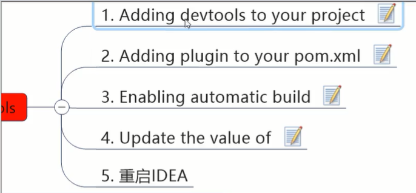


1.

```xml
<dependency>
    <groupId>org.springframework.boot</groupId>
    <artifactId>spring-boot-devtools</artifactId>
    <scope>runtime</scope>
    <optional>true</optional>
</dependency>
```


2.

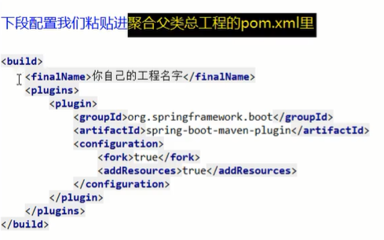

```xml
<plugin>
  <groupId>org.springframework.boot</groupId>
  <artifactId>spring-boot-maven-plugin</artifactId>
  <configuration>
    <fork>true</fork>
    <addResources>true</addResources>
  </configuration>
</plugin>
```


3.开启自动编译的选项

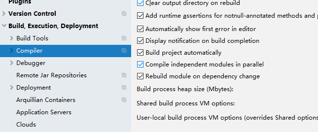

4.热注册开启

用快捷键

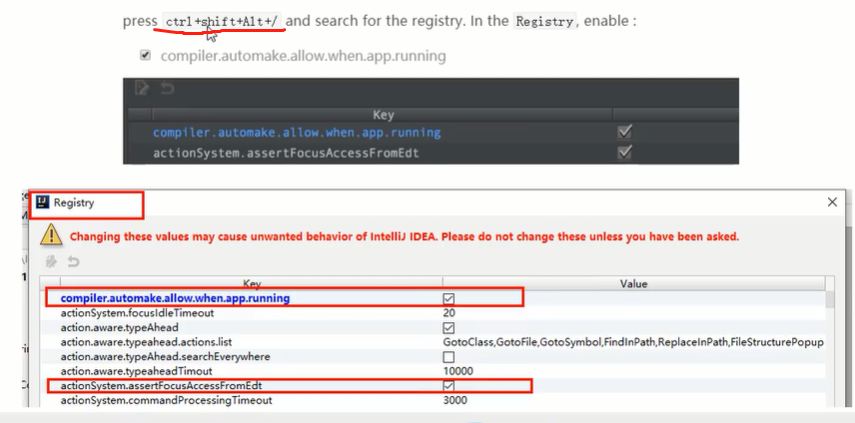

5.重启idea

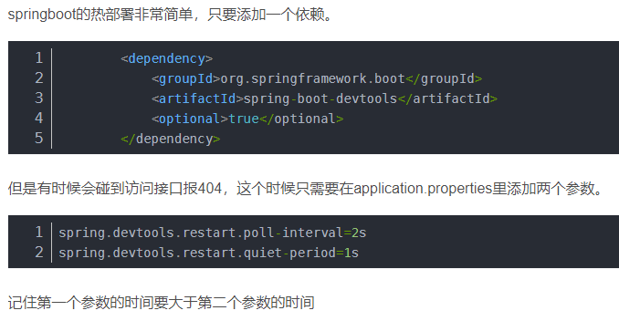


### 消费者订单模块

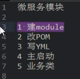

肌肉记忆

1.


2.就通用的

```xml
<dependencies>
    <dependency>
        <groupId>org.springframework.boot</groupId>
        <artifactId>spring-boot-starter-web</artifactId>
    </dependency>
    <dependency>
        <groupId>org.springframework.boot</groupId>
        <artifactId>spring-boot-starter-actuator</artifactId>
    </dependency>
    <dependency>
        <groupId>org.springframework.boot</groupId>
        <artifactId>spring-boot-devtools</artifactId>
        <scope>runtime</scope>
        <optional>true</optional>
    </dependency>
    <dependency>
        <groupId>org.projectlombok</groupId>
        <artifactId>lombok</artifactId>
        <optional>true</optional>
    </dependency>
    <dependency>
        <groupId>org.springframework.boot</groupId>
        <artifactId>spring-boot-starter-test</artifactId>
        <scope>test</scope>
    </dependency>
</dependencies>
```

3.

用户侧用80省去写端口，因为浏览器访问80可省略不写

4.

```
com.atguigu.springcloud.OrderMain80.class
```

5.客户端侧是去调提供端，所以只有controller。客户侧怎么可能有service和持久层去操作数据库！

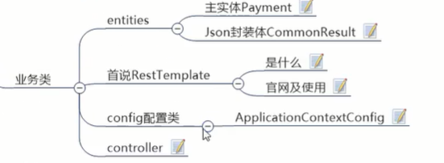

```java
@RestController
@Slf4j
public class OrderController {


}
```


好了，现在需要两个服务之间调用

原始的是用httpClient，

restTemplate相当于给httpClient做了封装，实现order微服务和payment微服务间的横向调用

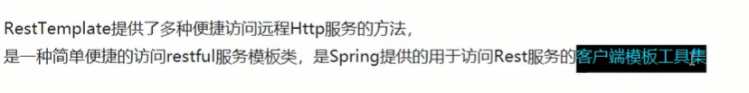


可以看到是spring出的,web下client端用的template

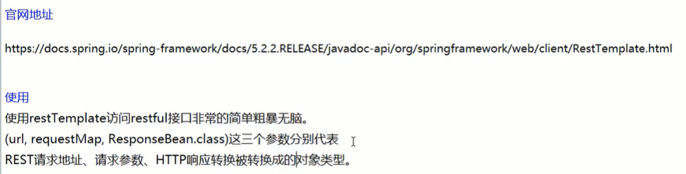


springboot是容器类的方式，所以先把它注入到容器，用一个关于容器的配置类

config.ApplicationContextConfig.class

```java
@Configuration
public class ApplicationContextConfig {
    @Bean
    public RestTemplate getRestTemplate(){
        return new RestTemplate();
    }
    
}
```

```java
@RestController
@Slf4j
public class OrderController {
    public static final String PAYMENT_URL = "http://localhost:8001";

    @Resource
    private RestTemplate restTemplate;

    @GetMapping("/consumer/payment/create")
    public CommonResult<Payment> create(Payment payment){
        return restTemplate.postForObject(PAYMENT_URL+"/payment/create",payment,CommonResult.class);

    }

    @GetMapping("/consumer/payment/get/{id}")
    public CommonResult<Payment> getPayment(@PathVariable("id")Long id){
        return restTemplate.getForObject(PAYMENT_URL+"/payment/get/"+id,CommonResult.class);
    }
}
```


启动两个

用这个dashboard/services来完成微服务的配置和启动工作：


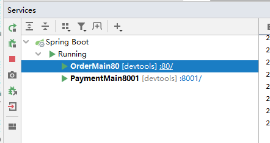


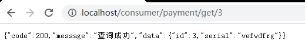

测试成功

对于插入：

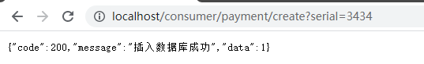


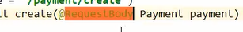

然后热部署


#工程重构

注意entities两个微服务里是重复冗余的

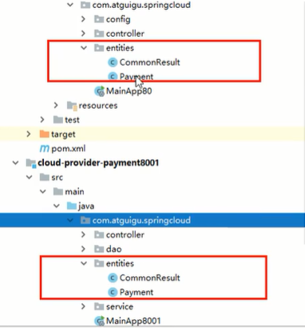


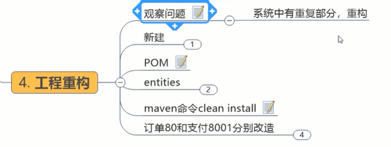


提到一个公开公用的工程里


```xml
<dependency>
    <groupId>org.springframework.boot</groupId>
    <artifactId>spring-boot-devtools</artifactId>
    <scope>runtime</scope>
    <optional>true</optional>
</dependency>
<dependency>
    <groupId>org.projectlombok</groupId>
    <artifactId>lombok</artifactId>
    <optional>true</optional>
</dependency>
<dependency>
    <groupId>cn.hutool</groupId>
    <artifactId>hutool-all</artifactId>
    <version>5.1.0</version>
</dependency>
```


安装jar包到本地仓库

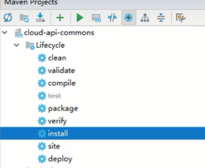


引入jar包

```xml
<dependency>
    <groupId>com.atguigu.springcloud</groupId>
    <artifactId>cloud-api-commons</artifactId>
    <version>${project.version}</version>
</dependency>
```


"我们就一步步蚂蚁搬家，基本上，就，万丈高楼平地起，慢慢的"


