前四章还没有引入任何springcloud的技术和组件

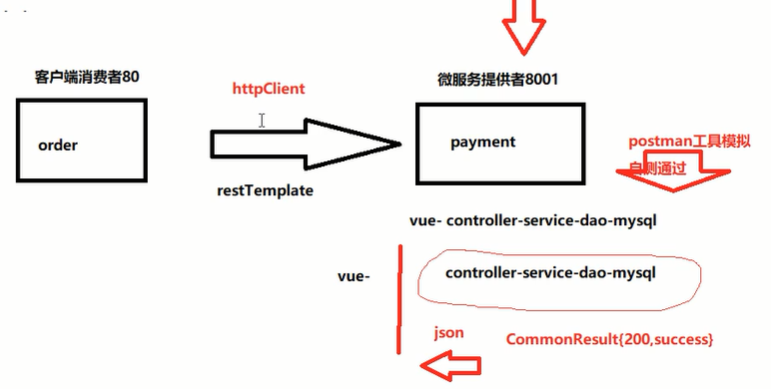

初级阶段，把这些技术一个个往上加，越来越庞大复杂，但也越来越强大

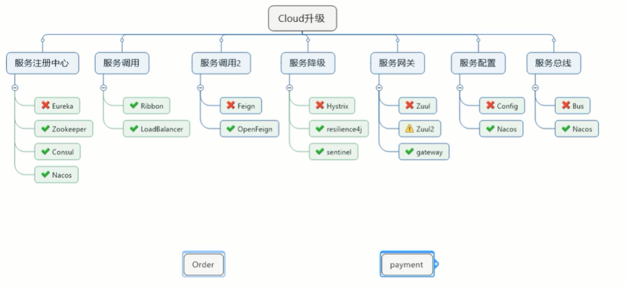


--->服务注册中心

当调用庞杂起来，需要一个中间管理系统

# Eureka服务注册与发现


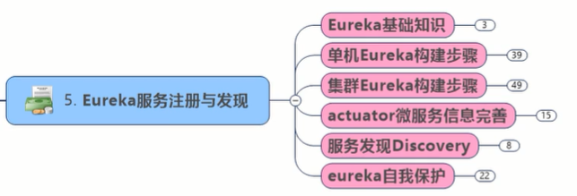

## Eureka基础知识

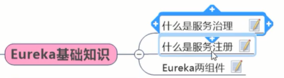


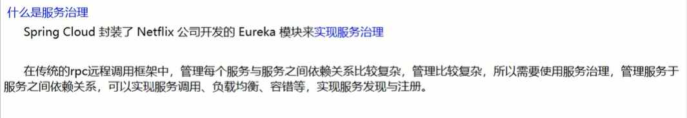

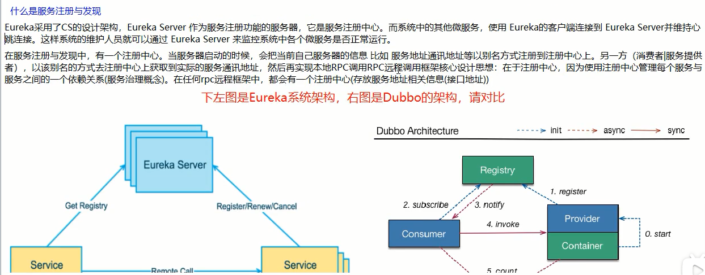

eureka的客户端和服务端维持心跳连接

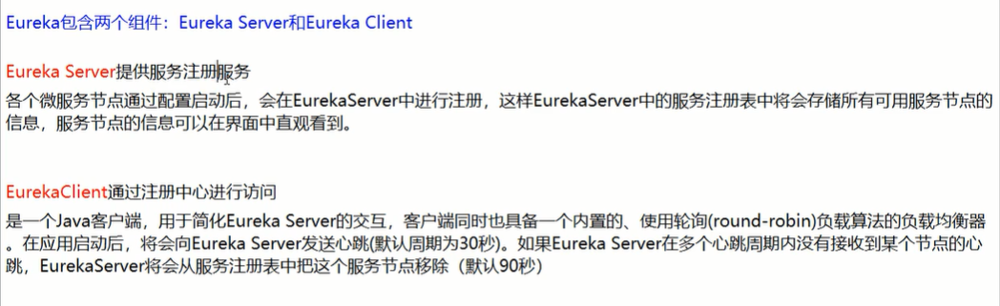

## 单机Eureka构建步骤

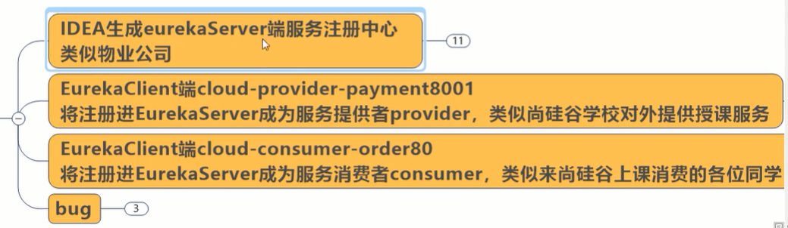

### idea生成eureka server端注册中心

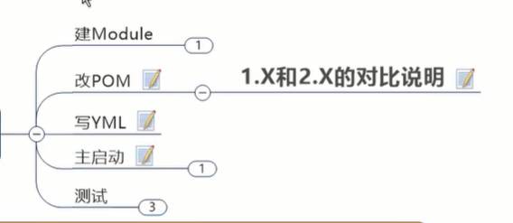


pom:

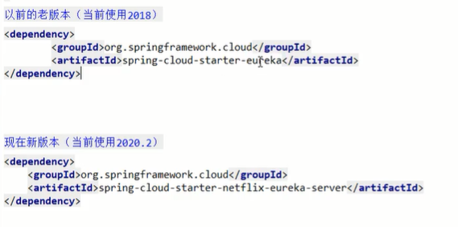

```xml
<!--eureka服务端-->
<dependency>
    <groupId>org.springframework.cloud</groupId>
    <artifactId>spring-cloud-starter-netflix-eureka-server</artifactId>
</dependency>
<!--我们的通用api-->
<dependency>
    <groupId>com.atguigu.springcloud</groupId>
    <artifactId>cloud-api-commons</artifactId>
    <version>${project.version}</version>
</dependency>
<dependency>
    <groupId>org.springframework.boot</groupId>
    <artifactId>spring-boot-starter-web</artifactId>
</dependency>
<dependency>
    <groupId>org.springframework.boot</groupId>
    <artifactId>spring-boot-starter-actuator</artifactId>
</dependency>
<!-- 一般通用配置-->
<dependency>
    <groupId>org.springframework.boot</groupId>
    <artifactId>spring-boot-devtools</artifactId>
    <scope>runtime</scope>
    <optional>true</optional>
</dependency>
<dependency>
    <groupId>org.projectlombok</groupId>
    <artifactId>lombok</artifactId>
    <optional>true</optional>
</dependency>
<dependency>
    <groupId>org.springframework.boot</groupId>
    <artifactId>spring-boot-starter-test</artifactId>
    <scope>test</scope>
</dependency>
```

application.yml:

```yml
server:
  port: 7001

eureka:
  instance:
    hostname: localhost #eureka服务端的实例名称
  client:
    register-with-eureka: false #false表示不向注册中心注册自己
    fetch-registry: false #false表示自己端就是注册中心，我的职责就是维护服务实例，并不需要去检索服务
    service-url: #没置与Eureka server交互的地址。查询服务和注册服务都需要依赖这个地址
      defaultZone: http://${eureka.instance.hostname}:${server.port}/eureka/
```

主启动：

```
com.atguigu.springcloud.EurekaMain7001.class
```

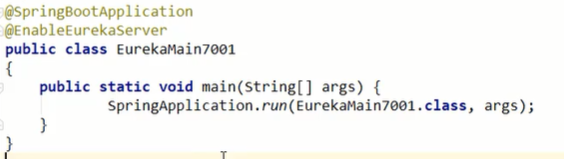

用@EnableEurekaServer告诉，我就是eureka的注册中心，我来管配置 登记和注册

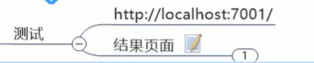

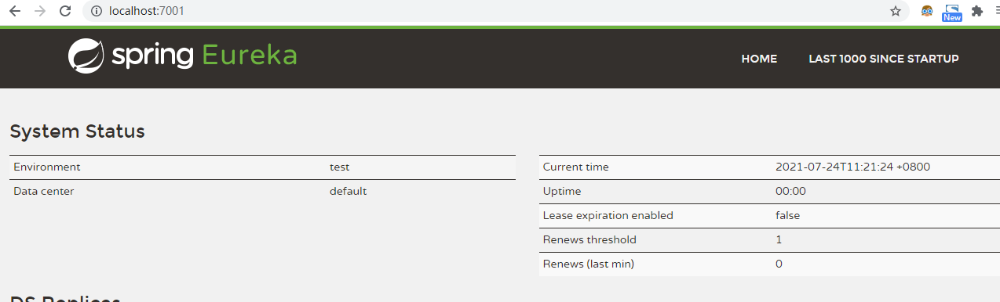


### 服务提供者注册进去作为客户端

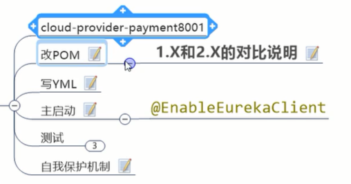

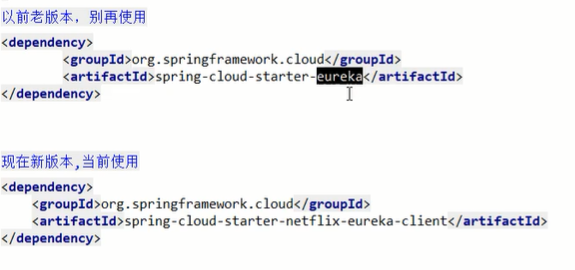

```xml
<!-- eureka-client -->
<dependency>
    <groupId>org.springframework.cloud</groupId>
    <artifactId>spring-cloud-starter-netflix-eureka-client</artifactId>
</dependency>
```

```yml
eureka:
  client:
    register-with-eureka: true #表示是否将自己注册进EurekaServer默认为true。
    fetchRegistry: true #是否从Eurekaserver抓取己有的注册信息，默认为true。单节点无所谓，集群必须设置为true才能配合ribbon使用负载均衡
    service-url:
      defaultZone: http://localhost:7001/eureka
```


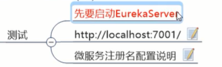


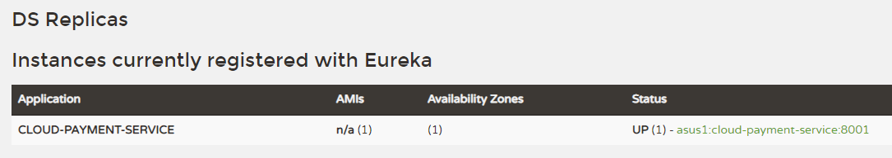

### 服务消费者注册进去作为客户端


```xml
<!-- eureka-client -->
<dependency>
    <groupId>org.springframework.cloud</groupId>
    <artifactId>spring-cloud-starter-netflix-eureka-client</artifactId>
</dependency>
```

```yml
spring:
  application:
    name: cloud-order-service

eureka:
  client:
    register-with-eureka: true #表示是否将自己注册进EurekaServer默认为true。
    fetchRegistry: true #是否从Eurekaserver抓取己有的注册信息，默认为true。单节点无所谓，集群必须设置为true才能配合ribbon使用负载均衡
    service-url:
      defaultZone: http://localhost:7001/eureka
```


```
@EnableEurekaClient
```

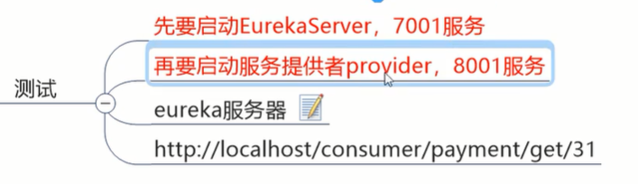


## 集群Eureka构建步骤

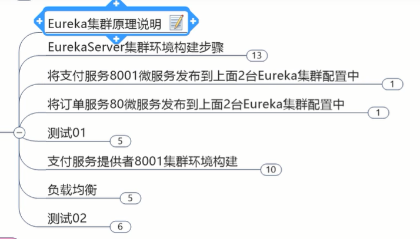

单点故障

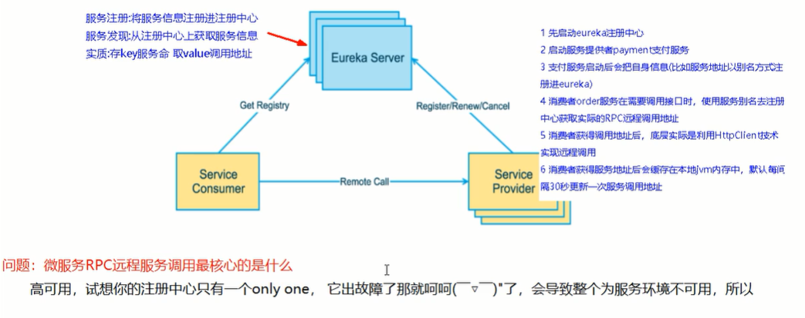


### 集群原理

互相注册，相互守望。对外暴露出一个整体

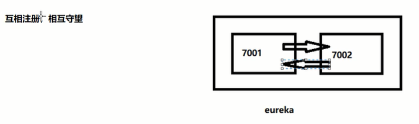

### 集群环境构建

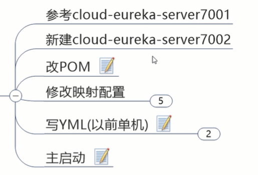

参考7001新建7002

修改映射配置文件：

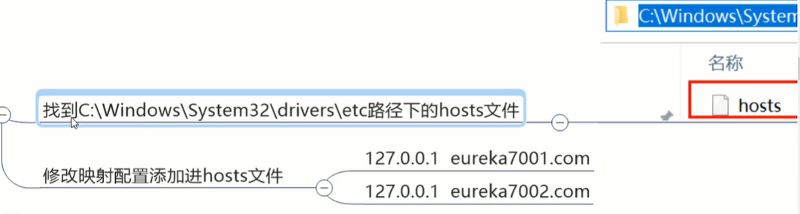

因为服务名不能都叫localhost。来模拟多台机器，eureka7001模拟一号机，eureka7002模拟二号机


写yml让它互相注册互相守望

7001的：

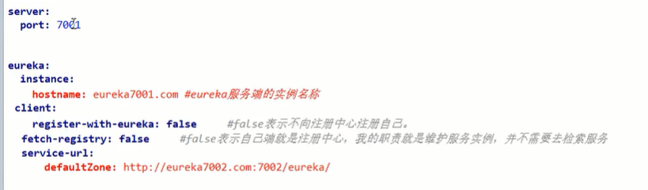

7002的：

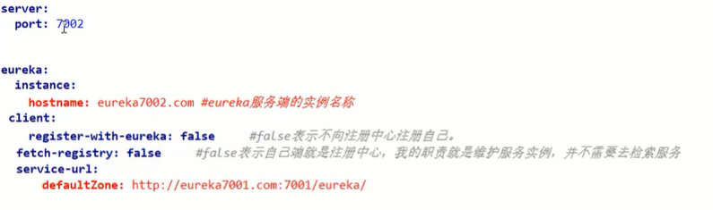


#关于eureka.client.serviceUrl.defaultZone:

http://www.heartthinkdo.com/?p=1933

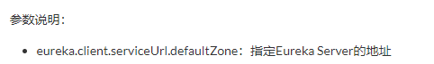

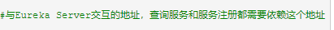

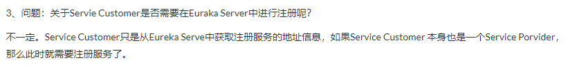

### 支付服务发布到集群

### 订单服务发布到集群

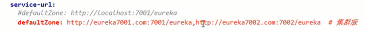

两个都往7001,7002上注册

```yml
service-url:
  defaultZone: http://eureka7001.com:7001/eureka,http://eureka7002.com:7002/eureka #集群版
```

### 测试

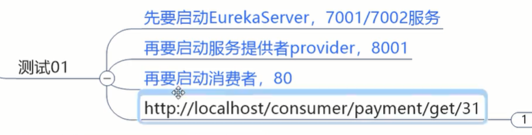

### 提供者集群环境构建

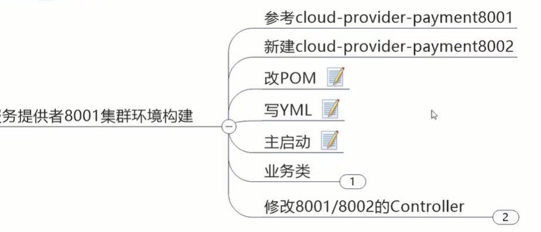

改写controller，让它打印自己的端口以辨认访问哪个提供者

相同服务名的提供者被轮询访问

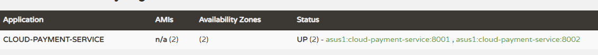


在访问客户端的消费者时，把

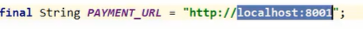

修改为微服务名称

只这样做，访问时不知道访问指定微服务下哪台机器，

要在RestTemplate开启负载均衡功能

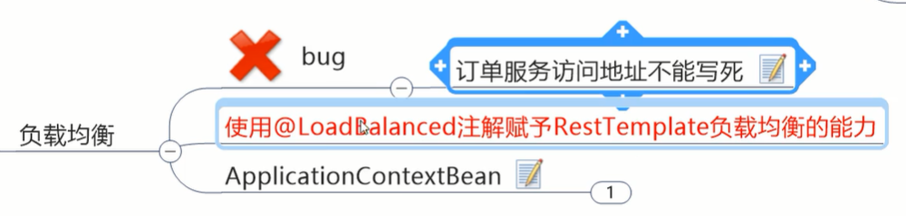

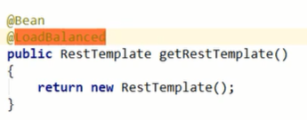

测试成功：

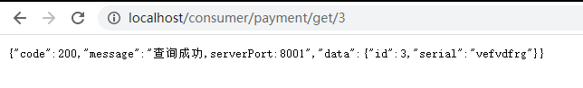

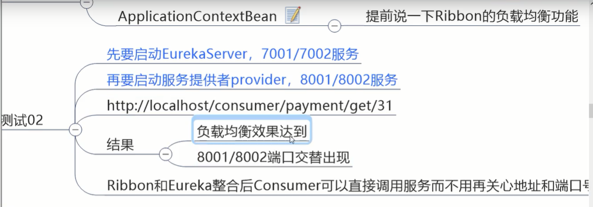

【理解】

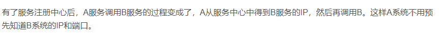

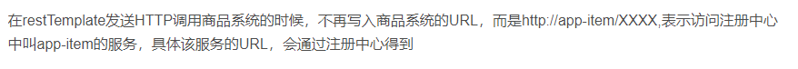

### actuator微服务信息完善

前边已经加入了actuator依赖

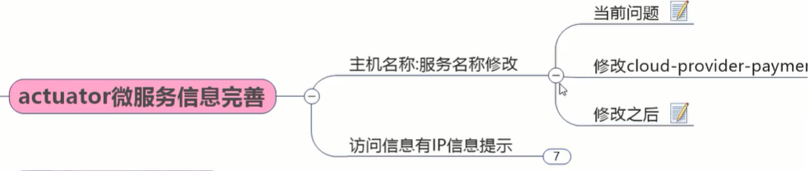

1.想在这只暴露服务名，不要出现主机名

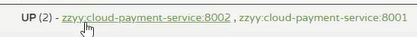

是在服务提供者8001,8002上配置：

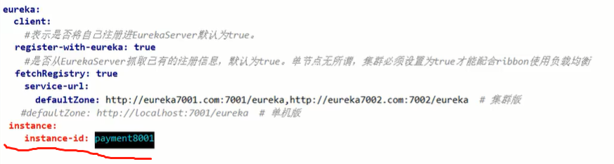

加个instance，这个是主机名的修改


2.鼠标移上去显示ip地址

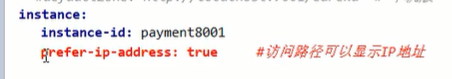

本人测试成功


### 服务发现Discovery

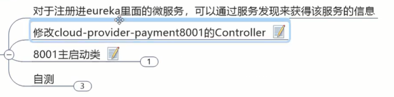


【这个RestTemplate，我看是没使用eureka时可以发http请求；使用eureka时能通过服务名发请求，还能用负载均衡。  eureka远程调用的核心不就是注册中心，拿着别名去注册中心得到通讯地址】


怎么才能把自身的服务暴露给人家呢

可以随便在一个客户端上(如8001)：

服务发现client端：

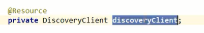


获取微服务名称列表

根据微服务名称获取实例列表

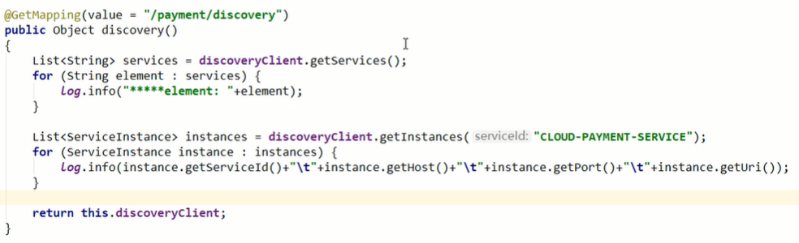


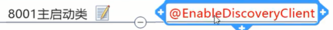


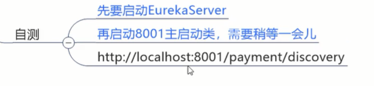


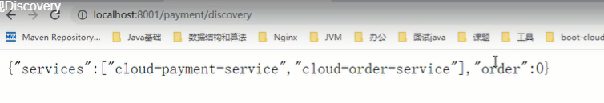


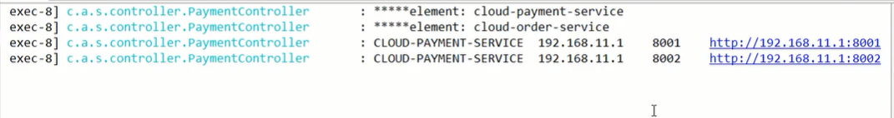


本人测试：


### Eureka自我保护理论知识


一旦进入保护模式，eureka不再删除服务注册表中的数据，不会注销任何微服务。是一种高可用的设计想法


短时间内丢失过多客户端时(可能发生网络分区故障)


### 怎么禁止自我保护


```yml
eureka:
    server:
      enable-self-preservation: false #关闭自我保护机制，保证不可用服务被及时剔除
      eviction-interval-timer-in-ms: 2000 #默认心跳时间是90秒 这边改短来测试
```


启动7001可以看到已经关了安全模式


在8001:


```yml
instance:
  instance-id: payment8001
  prefer-ip-address: true #访问路径可以显示IP地址
  lease-renewal-interval-in-seconds: 1 #eureka客户端向服务端发送心跳的时间间隔(秒) 默认30
  lease-expiration-duration-in-seconds: 2 #eureka服务端收到一次心跳后等待时间上限(秒) 默认90 超时将剔除服务
```


自测成功


### Eureka停更说明


在eureka官网可以看到eureka2.0已经停更；

1.0仍active。

目前停更不停用，使用后果自负

---->SpringCloud整合Zookeeper代替Eureka

(原来可能dubbo+zookeeper，可springcloud替代dubbo)


