# zookeeper代替eureka

## 注册中心zookeeper

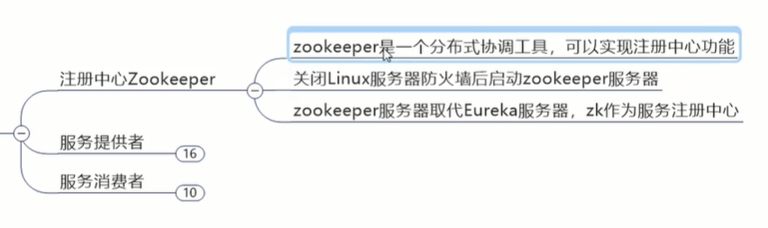

#centos安装zookeeper  √

#关闭linux防火墙   systemctl stop firewalld

systemctl status firewalld  √

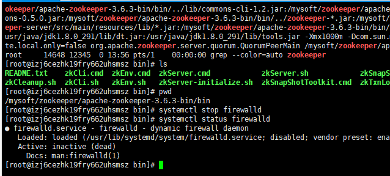

#linux和java程序所在机互相ping通  √


## 服务提供者

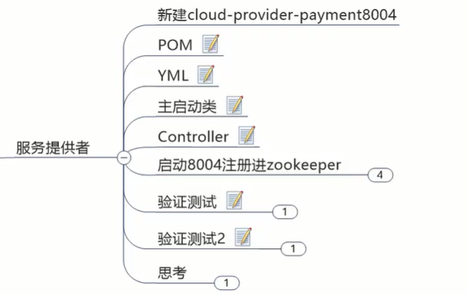


#pom:

```xml
<dependencies>
    <dependency>
        <groupId>com.atguigu.springcloud</groupId>
        <artifactId>cloud-api-commons</artifactId>
        <version>${project.version}</version>
    </dependency>
    <dependency>
        <groupId>org.springframework.boot</groupId>
        <artifactId>spring-boot-starter-web</artifactId>
    </dependency>
    <!-- springboot整合zookeeper客户端 -->
    <dependency>
        <groupId>org.springframework.cloud</groupId>
        <artifactId>spring-cloud-starter-zookeeper-discovery</artifactId>
    </dependency>
    <dependency>
        <groupId>org.springframework.boot</groupId>
        <artifactId>spring-boot-devtools</artifactId>
        <scope>runtime</scope>
        <optional>true</optional>
    </dependency>
    <dependency>
        <groupId>org.projectlombok</groupId>
        <artifactId>lombok</artifactId>
        <optional>true</optional>
    </dependency>

</dependencies>
```

#yml:

```yml
server:
  port: 8004

spring:
  application:
    name: cloud-provider-payment
  cloud:
    zookeeper:
      connect-string: 47.243.23.197:2181
```

#主启动类：

com.atguigu.springcloud.PaymentMain8004

```java
@SpringBootApplication
@EnableDiscoveryClient
public class PaymentMain8004 {
    public static void main(String[] args) {
        SpringApplication.run(PaymentMain8004.class,args);
    }
}
```

@EnableDiscoveryClient 使用consul或zookeeper作为注册中心时，该注解向注册中心注册服务（用eureka时是发现服务）


#controller

```java
@RestController
@Slf4j
public class PaymentController {
    @Value("${server.port}")
    private String serverPort;

    @RequestMapping(value="/payment/zk")
    public String paymentzk(){
        return "springcloud with zookeeper:"+serverPort+"\t"+ UUID.randomUUID().toString();
    }

}
```

这样可以每次访问返回端口号和流水号，每次访问流水号都不一样代表访问成功


#到此zookeeper配置已经完成，启动8004注册进zookeeper

先启动zookeeper:

用客户端连接 ls / 可以看到根节点下只有一个'zookeeper'

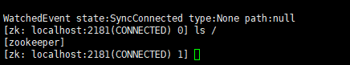

启动8004，

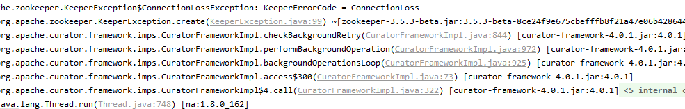

注意这个3.5.3beta报错

3.5.3beta是引入zookeeper-discovery依赖自带的，我们的zookerper版本是别的，会产生jar包冲突


只需做jar包排除和引入

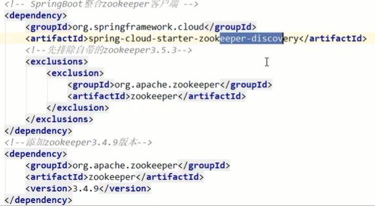

别忘了云服务器开放端口

启动成功   √

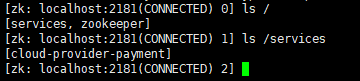

支付模块成功入驻zookeeper


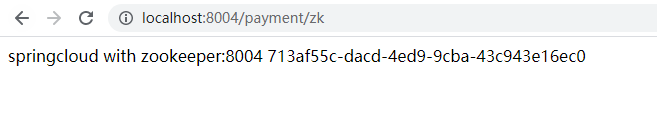


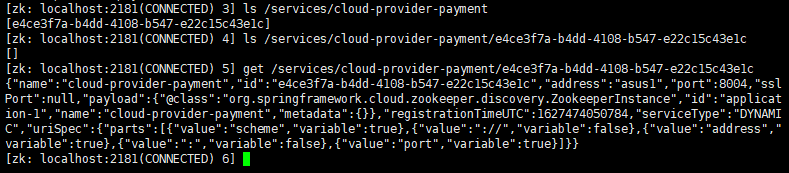

这是它一个内部编码流水号，json值就是在zookeeper上的基本信息


每一个微服务作为一个znode节点，放到了zookeeper里

你把微服务干掉，一小段心跳后，zookeeper把这个节点干掉，

所以是临时节点

再启动会用个新流水号作节点


## 订单服务注册进zookeeper

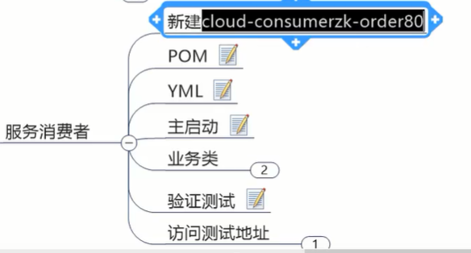

pom跟8004一样

yml一样：

```yml
server:
  port: 80

spring:
  application:
    name: cloud-consumer-order
  cloud:
    zookeeper:
      connect-string: 47.243.23.197:2181
```

com.atguigu.springcloud.OrderZKMain80

```java
@SpringBootApplication
@EnableDiscoveryClient
public class OrderZKMain80 {
    public static void main(String[] args) {
        SpringApplication.run(OrderZKMain80.class,args);
    }
}
```

业务类：用restTemplate调用

```java
@RestController
@Slf4j
public class OrderZKController {
    public static final String INVOKE_URL = "http://cloud-provider-payment";

    @Resource
    private RestTemplate restTemplate;

    @GetMapping(value = "/consumer/payment/zk")
    public String paymentInfo(){
        String result = restTemplate.getForObject(INVOKE_URL+"/payment/zk",String.class);
        return result;
    }
}
```

两个都启动，两个都找到了zookeeper上面，

调用消费者，它就能通过微服务名找到提供者地址


# Consul服务注册与发现

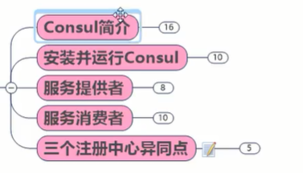

## Consul简介

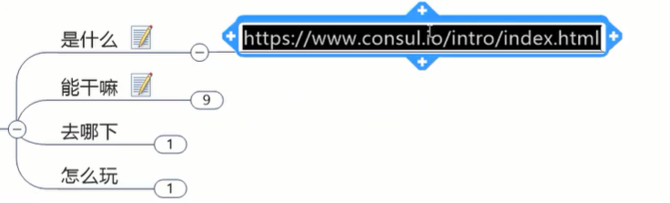


#是什么

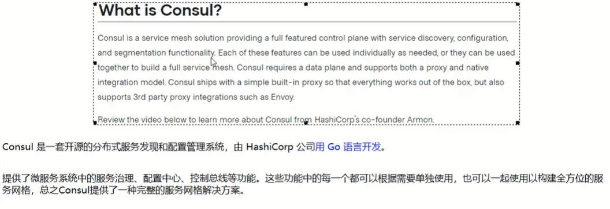


#能干嘛

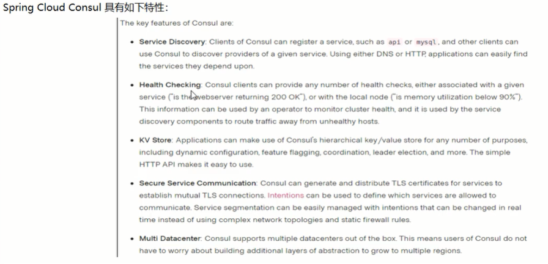

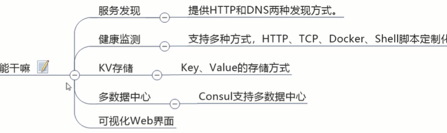


## 安装并运行

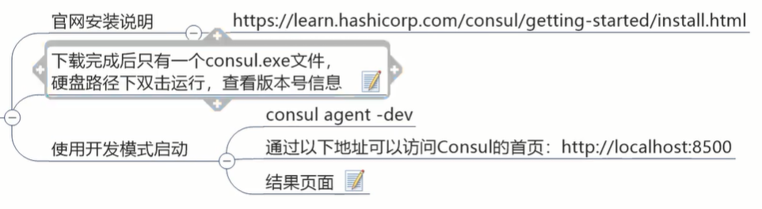


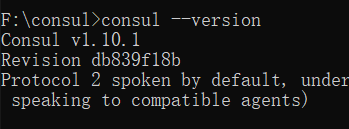


consul agent -dev启动

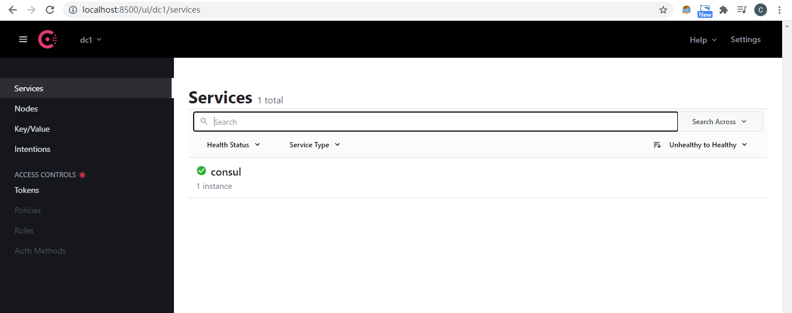


## 服务提供者

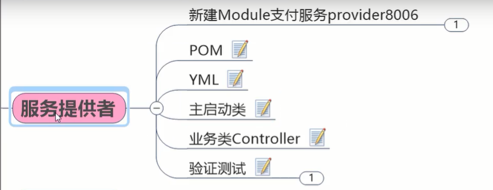


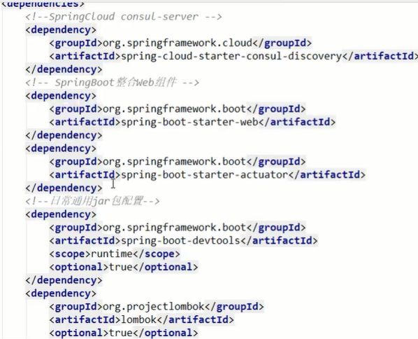

```xml
<dependencies>
    <!-- springCloud consul-server -->
    <dependency>
        <groupId>org.springframework.cloud</groupId>
        <artifactId>spring-cloud-starter-consul-discovery</artifactId>
    </dependency>
    <dependency>
        <groupId>com.atguigu.springcloud</groupId>
        <artifactId>cloud-api-commons</artifactId>
        <version>${project.version}</version>
    </dependency>
    <dependency>
        <groupId>org.springframework.boot</groupId>
        <artifactId>spring-boot-starter-web</artifactId>
    </dependency>
    
    <dependency>
        <groupId>org.springframework.boot</groupId>
        <artifactId>spring-boot-devtools</artifactId>
        <scope>runtime</scope>
        <optional>true</optional>
    </dependency>
    <dependency>
        <groupId>org.projectlombok</groupId>
        <artifactId>lombok</artifactId>
        <optional>true</optional>
    </dependency>

</dependencies>
```

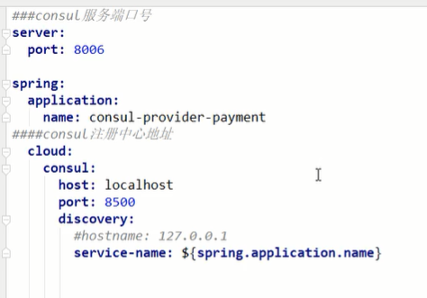

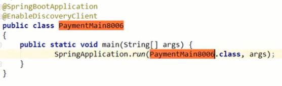

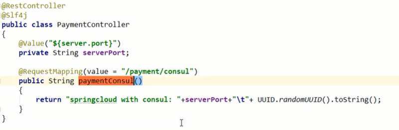

启动：

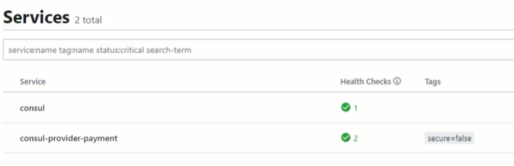

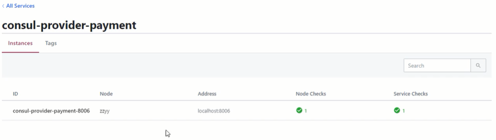


添加actuator依赖后没有红叉

## 服务消费者

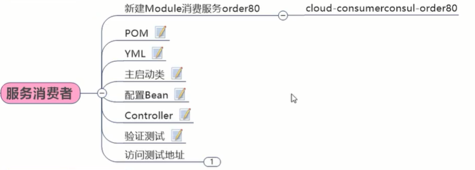


```xml
<dependencies>
    <!-- springCloud consul-server -->
    <dependency>
        <groupId>org.springframework.cloud</groupId>
        <artifactId>spring-cloud-starter-consul-discovery</artifactId>
    </dependency>
    <dependency>
        <groupId>org.springframework.boot</groupId>
        <artifactId>spring-boot-starter-web</artifactId>
    </dependency>
    <dependency>
        <groupId>org.springframework.boot</groupId>
        <artifactId>spring-boot-starter-actuator</artifactId>
    </dependency>

    <dependency>
        <groupId>org.springframework.boot</groupId>
        <artifactId>spring-boot-devtools</artifactId>
        <scope>runtime</scope>
        <optional>true</optional>
    </dependency>
    <dependency>
        <groupId>org.projectlombok</groupId>
        <artifactId>lombok</artifactId>
        <optional>true</optional>
    </dependency>

</dependencies>
```

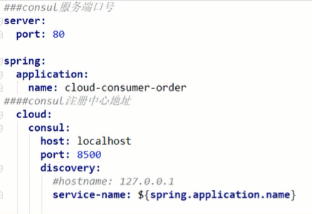

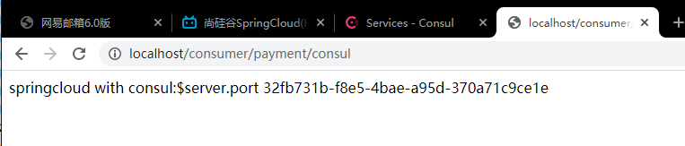


## 三个注册中心异同点

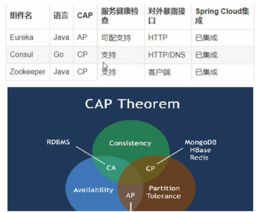

可以看到Eureka 是AP ，主要保证的是高可用

Consul和Zookeeper CP，主要保证的是数据一致

e和c对外都有web界面，z是linux客户端

三个都已对cloud集成


CAP理论

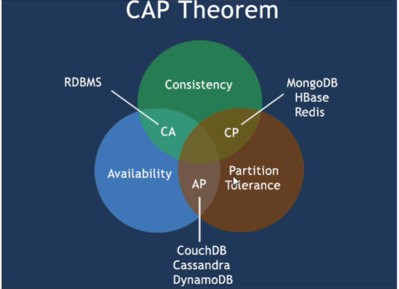

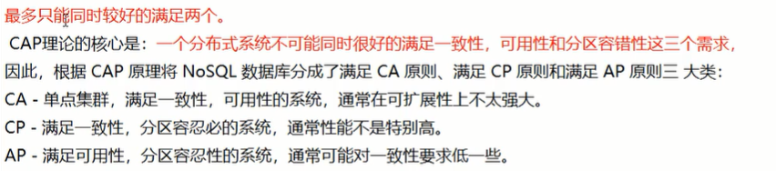


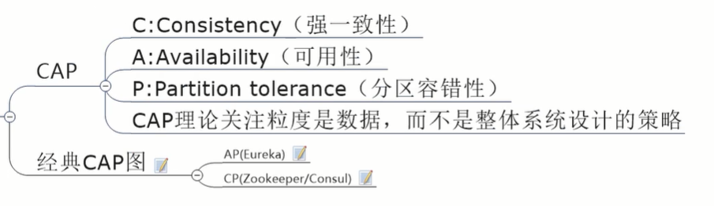

如京东点赞，很多人大量点赞，返回的数据是138，实际是145，允许这样的数据不一致以保证可用性

但如果数据不一致到东西都不能买了，是不允许的


AP情况下，保高可用：

存在网络分区的情况下，系统A把x=2了，系统B还是旧值，这时A去调B，返回的是旧值

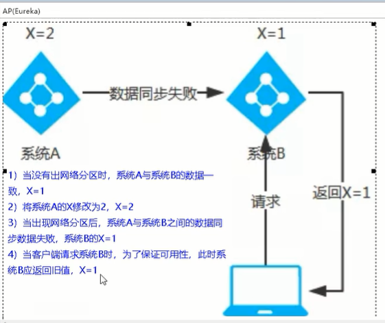

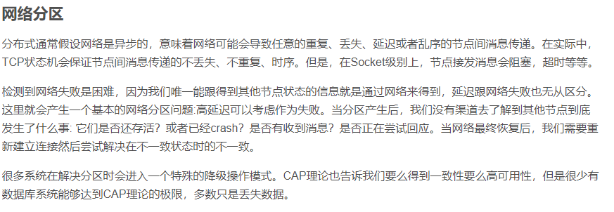


CP情况下：

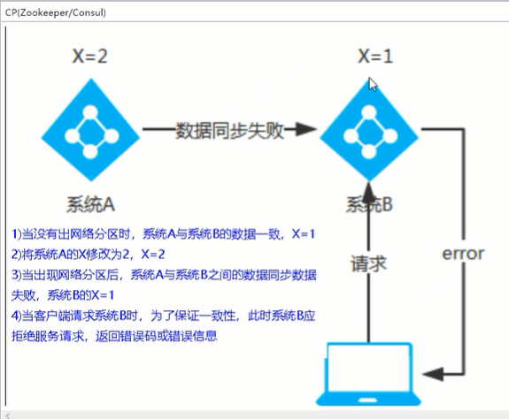

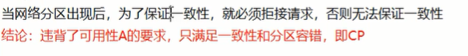


