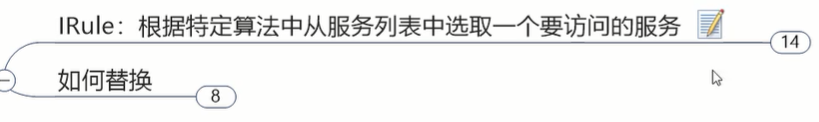
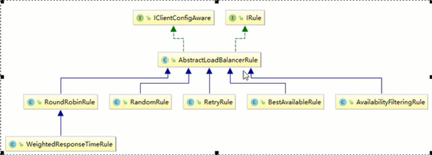
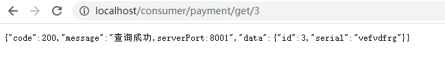

# Ribbon负载均衡服务调用

## 概述


实际上就是一个负载均衡+服务调用的小组件 客户端工具

ribbon目前进入维护，但生产环境上还在大规模部署使用

未来springcloud想用Loadbalancer把ribbon替代


进医院大门是nginx，进科室是ribbon


一句话：实现负载均衡+RestTemplate调用


## Ribbon负载均衡演示


之前已经实现了负载均衡，实际上，

spring-cloud-starter-netflix-eureka-client自带了spring-cloud-starter-ribbon引用：


getForObject和getForEntity区别：


也就是你想要响应的更详细的信息，就用ForEntity，只想得到响应体的json就用ForObject


## Ribbon核心组件IRule



IRule是属于ribbon的一个接口，定义几种负载均衡方式




替换负载均衡：


所以不能在主启动类所在包

新建一个自己的规则包com.atguigu.myrule

新建规则类


在主启动类加@RibbonClient配置，指定ribbon访问哪个微服务，使用什么负载均衡策略




切换成随机的负载均衡 ，测试成功


## Ribbon负载均衡算法


就这？


源码：RoundRobinRule.class


这里用了自旋锁和CAS

，去尚硅谷JUC把原理搞明白


8001，8002的控制器：


很简单，就是返回一下自己的端口以区分


80订单模块：


创建接口(面向接口编程，你有什么需求先写接口)


```java
public interface LoadBalancer {
    ServiceInstance instances(List<ServiceInstance> serviceInstances);
}
```


先写线程安全的获取下个值的方法，用cas(compareAndSet(current,next))+自旋锁

，这样尽量不去加synchronize,lock那些相对于自旋锁更重的互斥方式


```java
@Component
public class MyLB implements LoadBalancer {

    private AtomicInteger atomicInteger = new AtomicInteger(0);

    //重要的方法不允许继承不允许乱改，限制为final
    //用自旋锁
    //2147483647是整型最大值
    public final int getAndIncrement(){
        int current;
        int next;
        do{
            current = this.atomicInteger.get();
            next = current >= 2147483647 ? 0 : current + 1;
        }while(!this.atomicInteger.compareAndSet(current,next));

        System.out.println("****第几次访问，次数next:"+next);
        return next;
    }

    @Override
    public ServiceInstance instances(List<ServiceInstance> serviceInstances) {
        int index = getAndIncrement() % serviceInstances.size();
        return serviceInstances.get(index);
    }
}
```


在80控制器做负载均衡：

```java
@RestController
@Slf4j
public class OrderController {
    //public static final String PAYMENT_URL = "http://localhost:8001";
    public static final String PAYMENT_URL = "http://CLOUD-PAYMENT-SERVICE";

    @Resource
    private RestTemplate restTemplate;

    @Resource
    private LoadBalancer loadBalancer;
    @Resource
    private DiscoveryClient discoveryClient;

    @GetMapping("/consumer/payment/create")
    public CommonResult<Payment> create(Payment payment){
        return restTemplate.postForObject(PAYMENT_URL+"/payment/create",payment,CommonResult.class);

    }

    @GetMapping("/consumer/payment/get/{id}")
    public CommonResult<Payment> getPayment(@PathVariable("id")Long id){
        return restTemplate.getForObject(PAYMENT_URL+"/payment/get/"+id,CommonResult.class);
    }

    @GetMapping("/consumer/payment/lb")
    public String getPaymentLB(){
        List<ServiceInstance> instances = discoveryClient.getInstances("CLOUD-PAYMENT-SERVICE");
        if(instances==null || instances.size()<=0){
            return null;
        }
        ServiceInstance instance = loadBalancer.instances(instances);
        URI uri = instance.getUri();

        return restTemplate.getForObject(uri+"/payment/lb",String.class);
    }
}
```


