# OpenFeign

## 1.概述

#OpenFeign是什么

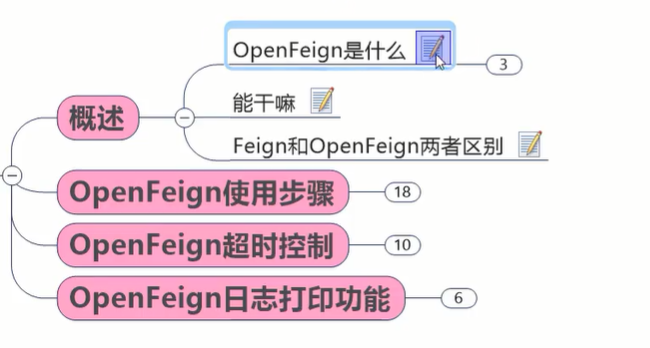

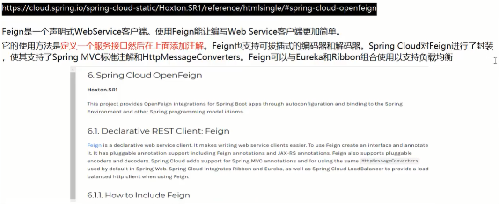


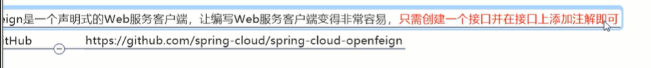


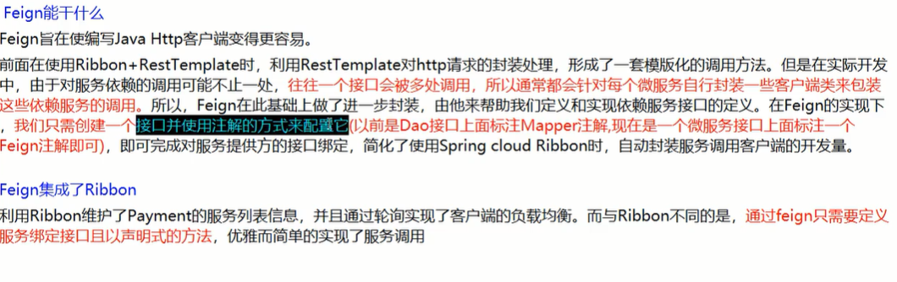

更加面向接口，省去手动使用restTemplate去调用。消费者方搞一组跟提供方一样的接口，直接接口对接口

最终Feign集成了Ribbon，说明它同样也实现了客户端的负载均衡


#Feign和OpenFeign区别

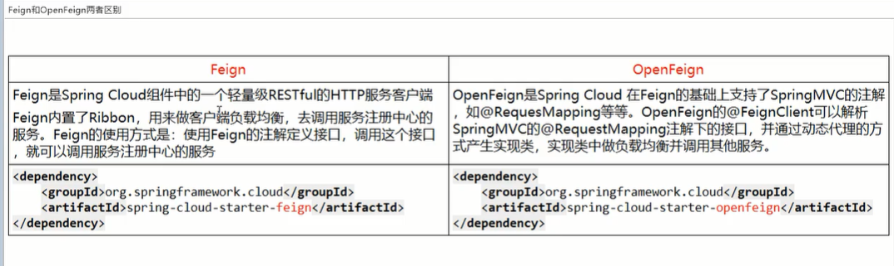


## 2.使用步骤

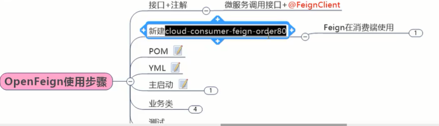

```xml
<dependencies>
    <dependency>
        <groupId>org.springframework.cloud</groupId>
        <artifactId>spring-cloud-openfeign-core</artifactId>
    </dependency>

    <dependency>
        <groupId>org.springframework.cloud</groupId>
        <artifactId>spring-cloud-starter-netflix-eureka-client</artifactId>
    </dependency>
    <dependency>
        <groupId>com.atguigu.springcloud</groupId>
        <artifactId>cloud-api-commons</artifactId>
        <version>${project.version}</version>
    </dependency>
    <dependency>
        <groupId>org.springframework.boot</groupId>
        <artifactId>spring-boot-starter-web</artifactId>
    </dependency>
    <dependency>
        <groupId>org.springframework.boot</groupId>
        <artifactId>spring-boot-starter-actuator</artifactId>
    </dependency>
    <dependency>
        <groupId>org.springframework.boot</groupId>
        <artifactId>spring-boot-devtools</artifactId>
        <scope>runtime</scope>
        <optional>true</optional>
    </dependency>
    <dependency>
        <groupId>org.projectlombok</groupId>
        <artifactId>lombok</artifactId>
        <optional>true</optional>
    </dependency>
    <dependency>
        <groupId>org.springframework.boot</groupId>
        <artifactId>spring-boot-starter-test</artifactId>
        <scope>test</scope>
    </dependency>
</dependencies>
```

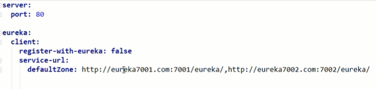

```java
@SpringBootApplication
@EnableFeignClients
public class OrderFeignMain80 {
    public static void main(String[] args) {
        SpringApplication.run(OrderFeignMain80.class,args);
    }
}
```


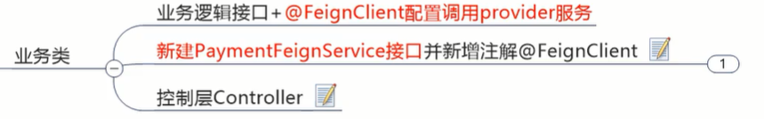


```java
@Component
@FeignClient("cloud-payment-service")
public interface PaymentFeignService {
    @GetMapping(value="/payment/get/{id}")
    CommonResult<Payment> getPaymentById(@PathVariable("id") Long id);
}
```


```java
@RestController
@Slf4j
public class OrderFeignController {
    @Resource
    private PaymentFeignService paymentFeignService;

    @GetMapping(value="/consumer/payment/get/{id}")
    public CommonResult<Payment> getPaymentById(@PathVariable("id") Long id){
        return paymentFeignService.getPaymentById(id);
    }
}
```


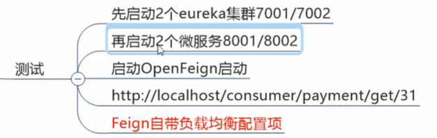


Feign因为集成了Ribbon，所以天生具有负载均衡


## 3.OpenFeign超时控制

消费侧去调服务侧，一定会产生一个现象：超时

提供者认为处理这个业务，3秒是正常的，消费者只愿意等2秒。时间差就会导致超时调用报错


### #故意演示超时出错

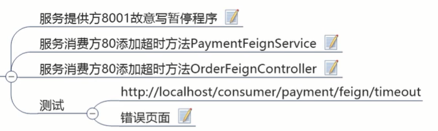

提供者这边：

```java
@GetMapping(value = "/payment/feign/timeout")
public String paymentFeignTimeout()  {
    //暂停几秒钟线程
    try{TimeUnit.SECONDS.sleep(3);}catch (Exception e){ e.printStackTrace(); }
    return serverPort;
}
```

消费侧加上feign接口：

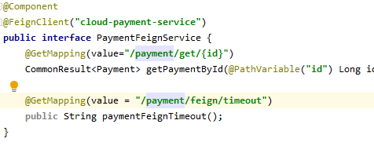

控制器：

```java
@GetMapping(value = "/consumer/payment/feign/timeout")
public String paymentFeignTimeout(){
    //openfeign-ribbon，客户端一般默认等待1秒
    return paymentFeignService.paymentFeignTimeout();
}
```

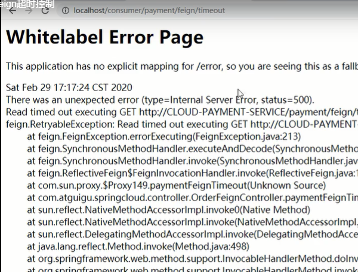


配置超时时间：

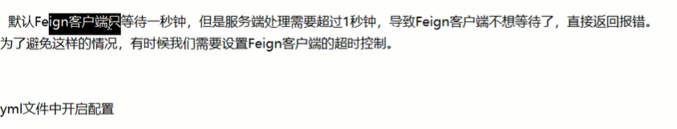

它的超时控制，由底子的ribbon来进行限制


## 4.OpenFeign日志打印功能

如果需要明确的知道feign的调用，

它提供日志打印功能来方便进行服务联调

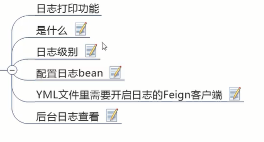

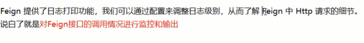

#日志级别

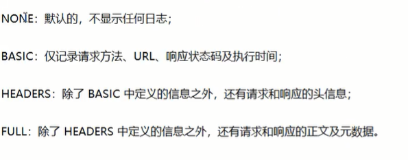

#配置日志bean

```java
@Configuration
public class FeignConfig {
    @Bean
    Logger.Level feignLoggerLevel(){
        return Logger.Level.FULL;
    }
}
```

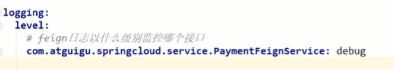

这里我import feign.Logger;报红，没有测试


