# Hystrix

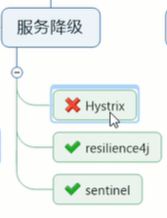

Hystrix springcloud停止更新了，但是它设计理念非常优秀，出道就是巅峰，服务降级，服务熔断，服务限流，服务隔离...一系列设计思想，是后面框架抄作业的必备良药

官网推荐的是resilience4j。中国国情是hystrix,阿里巴巴sentinel


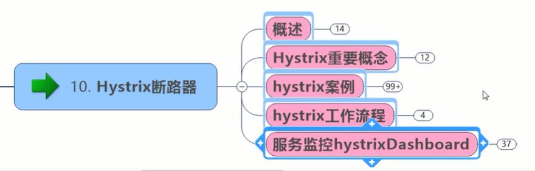

## 1.概述

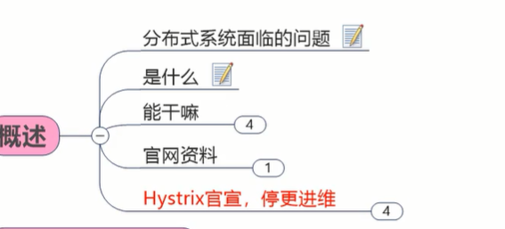

### #分布式系统面临的问题

现在讲究高内聚，低耦合。现在耦合是分开了，看项目里一个个分布式微服务，80调8001，8001调8002，8002调8006，链路越来越长，一条绳上的蚂蚱，一个出事，全体连坐

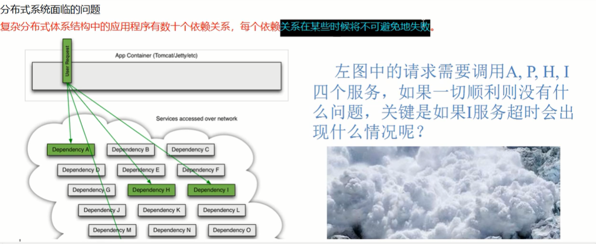

就像新冠肺炎一样

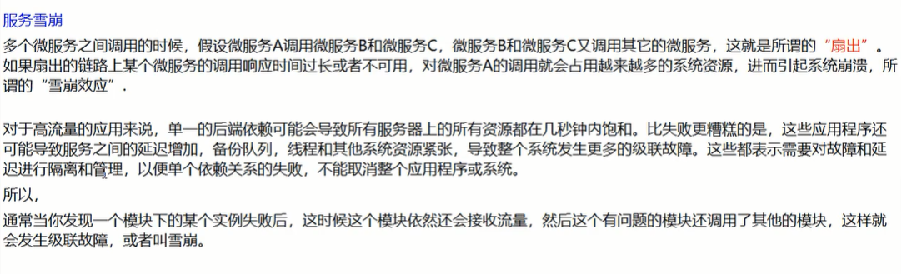

就像一把打开的折扇

高可用受到破坏


### #是什么

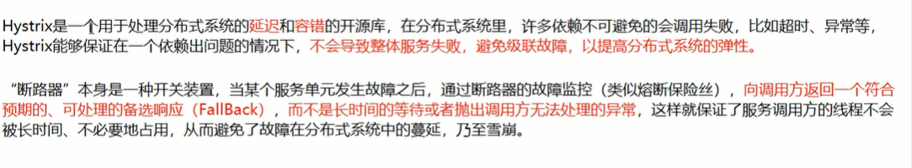

就是某个单元故障之后，有个兜底的备选响应


### #能干嘛

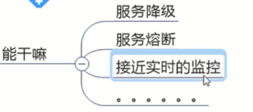

#当一切挂了，最好的学习文档在官网

在github上看 翻着过来


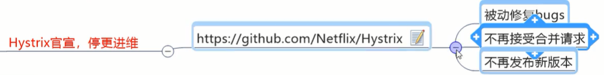

## 2.hystrix重要概念

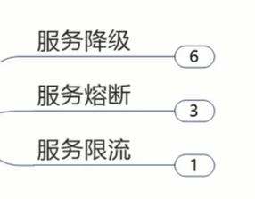

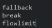

### #服务降级

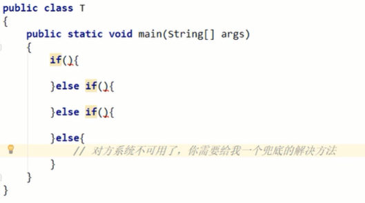


### #服务熔断


### #服务限流


## 3.hystrix案例

### #构建

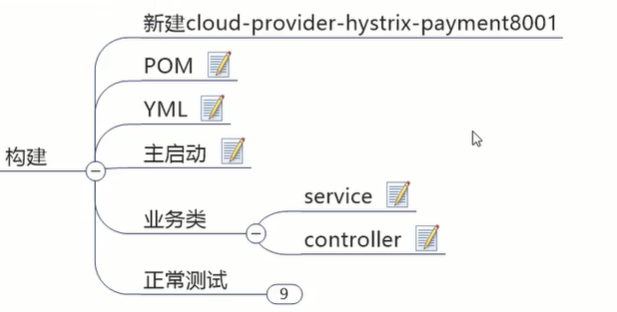


```xml
<dependencies>
    <!--hystrix-->
    <dependency>
        <groupId>org.springframework.cloud</groupId>
        <artifactId>spring-cloud-starter-netflix-hystrix</artifactId>
        <version>2.2.2.RELEASE</version>
    </dependency>
    <dependency>
        <groupId>org.springframework.cloud</groupId>
        <artifactId>spring-cloud-starter-netflix-eureka-client</artifactId>
    </dependency>
    <dependency>
        <groupId>com.atguigu.springcloud</groupId>
        <artifactId>cloud-api-commons</artifactId>
        <version>${project.version}</version>
    </dependency>
    <dependency>
        <groupId>org.springframework.boot</groupId>
        <artifactId>spring-boot-starter-web</artifactId>
    </dependency>
    <dependency>
        <groupId>org.springframework.boot</groupId>
        <artifactId>spring-boot-starter-actuator</artifactId>
    </dependency>
    <dependency>
        <groupId>com.alibaba</groupId>
        <artifactId>druid-spring-boot-starter</artifactId>
        <version>1.1.16</version>
    </dependency>
    <dependency>
        <groupId>org.springframework.boot</groupId>
        <artifactId>spring-boot-devtools</artifactId>
        <scope>runtime</scope>
        <optional>true</optional>
    </dependency>
    <dependency>
        <groupId>org.projectlombok</groupId>
        <artifactId>lombok</artifactId>
        <optional>true</optional>
    </dependency>
    <dependency>
        <groupId>org.springframework.boot</groupId>
        <artifactId>spring-boot-starter-test</artifactId>
        <scope>test</scope>
    </dependency>
</dependencies>
```


```yml
server:
  port: 8001

spring:
  application:
    name: cloud-provider-hystrix-payment

eureka:
  client:
    register-with-eureka: true
    fetch-registry: true
    service-url:
      defaultZone: http://eureka7001.com:7001/eureka
```


```java
@SpringBootApplication
@EnableEurekaClient
public class PaymentHystrixMain8001 {
    public static void main(String[] args) {
        SpringApplication.run(PaymentHystrixMain8001.class,args);
    }
}
```


```java
@Service
public class PaymentService {
    /**
     * 正常访问，肯定OK
     */
    public String paymentInfo_OK(Integer id){
        return "线程池：  "+Thread.currentThread().getName()+"  paymentInfo_OK,id:  "+id ;
    }

    public String paymentInfo_Timeout(Integer id){
        int timeNumber = 3;
        try{ TimeUnit.SECONDS.sleep(timeNumber); }catch (InterruptedException e){ e.printStackTrace(); }
        return "线程池：  "+Thread.currentThread().getName()+"  paymentInfo_TimeOut,id:  "+id +"  耗时："+timeNumber+"秒";
    }

}
```


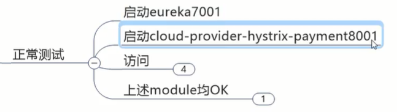

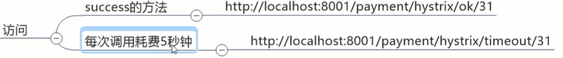

OK:

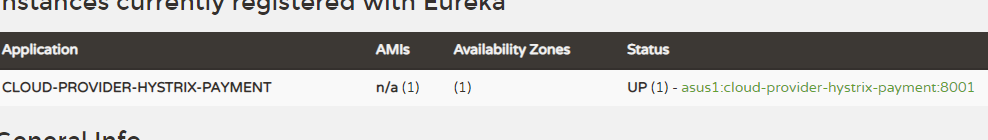

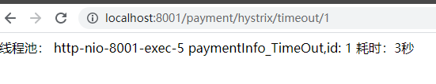


### #高并发测试

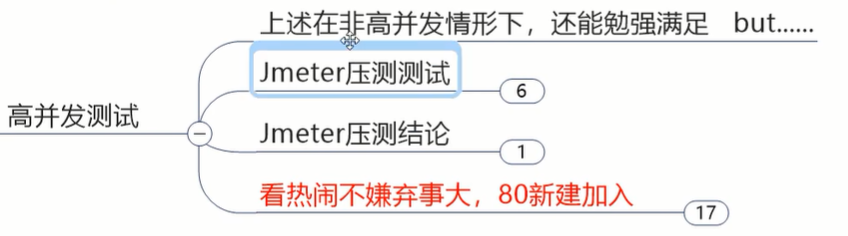

做分布式微服务架构都明白一句话，量变引起质变

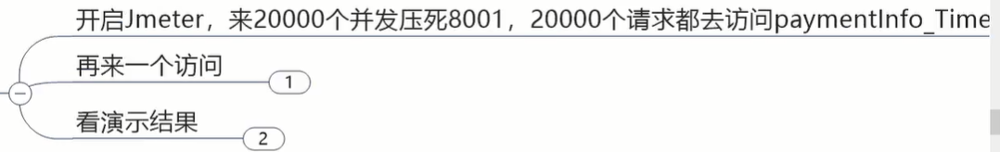


这就来搞死我的笔记本：

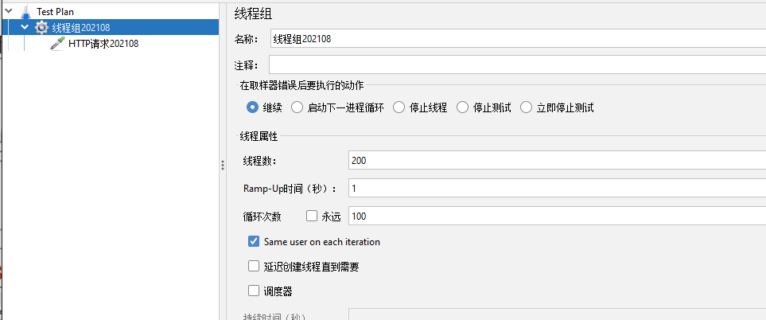

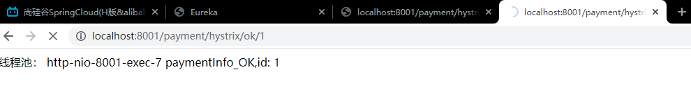

启动以后，ok的访问也会转圈


高并发打到timeout那边，微服务不得不集中资源处理，

重压之下把资源抽空，ok那边也会出现等待卡顿延时

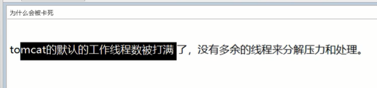


#压测结论：


打满cpu和线程，服务端被拖死，

这种情况下非常危险，必须有hystrix这样的框架对系统保护


#继续恶化，新建消费者

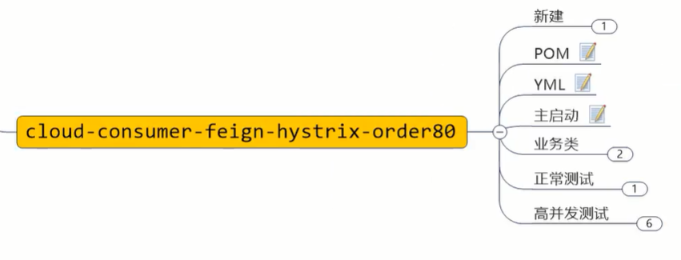

一般hystrix是用在消费侧做降级，不过它在消费侧服务侧都可以添加

```xml
<dependencies>
    <!--openfeign-->
    <dependency>
        <groupId>org.springframework.cloud</groupId>
        <artifactId>spring-cloud-starter-openfeign</artifactId>
    </dependency>
    <!--hystrix-->
    <dependency>
        <groupId>org.springframework.cloud</groupId>
        <artifactId>spring-cloud-starter-netflix-hystrix</artifactId>
        <!--<version>2.2.2.RELEASE</version>-->
    </dependency>
    <dependency>
        <groupId>org.springframework.cloud</groupId>
        <artifactId>spring-cloud-starter-netflix-eureka-client</artifactId>
    </dependency>
    <dependency>
        <groupId>com.atguigu.springcloud</groupId>
        <artifactId>cloud-api-commons</artifactId>
        <version>${project.version}</version>
    </dependency>
    <dependency>
        <groupId>org.springframework.boot</groupId>
        <artifactId>spring-boot-starter-web</artifactId>
    </dependency>
    <dependency>
        <groupId>org.springframework.boot</groupId>
        <artifactId>spring-boot-starter-actuator</artifactId>
    </dependency>
    <dependency>
        <groupId>mysql</groupId>
        <artifactId>mysql-connector-java</artifactId>
    </dependency>
    <dependency>
        <groupId>org.springframework.boot</groupId>
        <artifactId>spring-boot-devtools</artifactId>
        <scope>runtime</scope>
        <optional>true</optional>
    </dependency>
    <dependency>
        <groupId>org.projectlombok</groupId>
        <artifactId>lombok</artifactId>
        <optional>true</optional>
    </dependency>
    <dependency>
        <groupId>org.springframework.boot</groupId>
        <artifactId>spring-boot-starter-test</artifactId>
        <scope>test</scope>
    </dependency>
</dependencies>
```


```yml
server:
  port: 80

eureka:
  client:
    register-with-eureka: true
    service-url:
      defaultZone: http://eureka7001.com:7001/eureka
```


```java
@SpringBootApplication
@EnableFeignClients
public class OrderHystrixMain80 {
    public static void main(String[] args) {
        SpringApplication.run(OrderHystrixMain80.class,args);
    }
}
```


```java
@Component
@FeignClient(value = "CLOUD-PROVIDER-HYSTRIX-PAYMENT")
public interface PaymentHystrixService {

    @GetMapping("/payment/hystrix/ok/{id}")
    public String paymentInfo_OK(@PathVariable("id")Integer id);

    @GetMapping("/payment/hystrix/timeout/{id}")
    public String paymentInfo_TimeOut(@PathVariable("id")Integer id);
}
```


```java
@RestController
@Slf4j
public class OrderHystrixController {
    @Resource
    private PaymentHystrixService paymentHystrixService;

    @GetMapping("/consumer/payment/hystrix/ok/{id}")
    public String paymentInfo_OK(@PathVariable("id")Integer id){
        String result = paymentHystrixService.paymentInfo_OK(id);
        return result;
    }

    @GetMapping("/consumer/payment/hystrix/timeout/{id}")
    public String paymentInfo_TimeOut(@PathVariable("id")Integer id){
        String result = paymentHystrixService.paymentInfo_TimeOut(id);
        return result;
    }
}
```


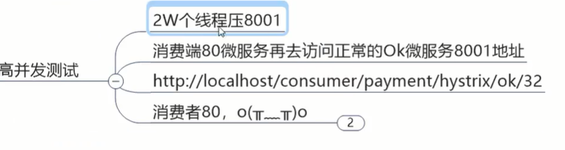


### #上述结论


### #如何解决

解决维度：

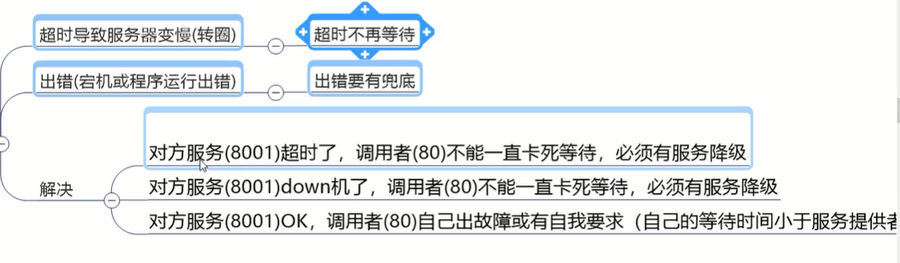


## 4.服务降级

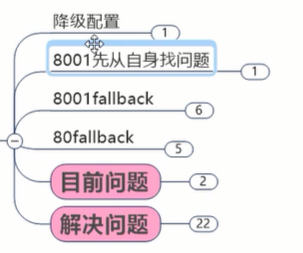

### #降级配置

@HystrixCommand


### #8001先从自身找问题


### #8001 fallback

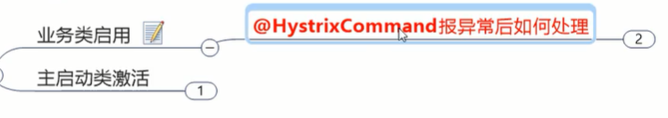


```java
@HystrixCommand(fallbackMethod = "paymentInfo_TimeoutHandler",commandProperties = {
        @HystrixProperty(name="execution.isolation.thread.timeoutInMilliseconds",value="3000")
})
public String paymentInfo_Timeout(Integer id){
    int timeNumber = 5;
    try{ TimeUnit.SECONDS.sleep(timeNumber); }catch (InterruptedException e){ e.printStackTrace(); }
    return "线程池：  "+Thread.currentThread().getName()+"  paymentInfo_TimeOut,id:  "+id +"  耗时："+timeNumber+"秒"+"  O(∩_∩)O";
}

public String paymentInfo_TimeoutHandler(Integer id){
    return "线程池：  "+Thread.currentThread().getName()+"  paymentInfo_TimeoutHandler,id:  "+id+"  ┭┮﹏┭┮";

}
```


**可以看到hystrix用单独的线程池，以隔离**


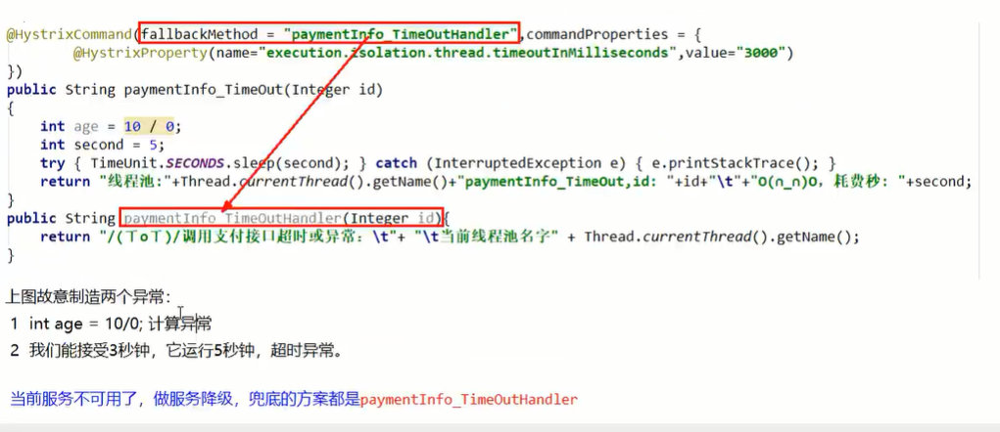

自己系统约定好一个峰值时间，超时就做服务降级

不然你系统一调用，系统就卡死了，越来越慢越来越慢，最终cpu内存打满，整个系统崩了


以上就是8001对自己做的保护和降级

### #80 fallback

你8001那边的服务降级定的可能是5秒，80这边或许定的是3秒，2秒，它不愿意等，马上就把请求中断，自己有自己的降级保护

一般做fallback服务降级就是在客户端。一双筷子夹土豆可以夹馒头也可以，只是更适合哪一个，根据你的业务

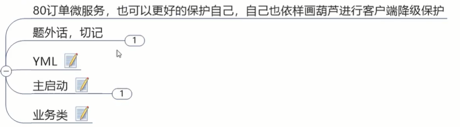


```yml
feign:
  hystrix:
    enabled: true
```


```java
@GetMapping("/consumer/payment/hystrix/timeout/{id}")
@HystrixCommand(fallbackMethod = "paymentInfo_TimeoutHandler",commandProperties = {
        @HystrixProperty(name="execution.isolation.thread.timeoutInMilliseconds",value="1500")
})
public String paymentInfo_TimeOut(@PathVariable("id")Integer id){
    String result = paymentHystrixService.paymentInfo_TimeOut(id);
    return result;
}
public String paymentInfo_TimeoutHandler(@PathVariable("id")Integer id){
    return "我是消费者80，对方支付系统繁忙请10秒后再试或自己运行出错请检查自己";
}
```

测试成功:


支付侧保护好，消费侧保护好，这样我们的系统越来越健壮


### #目前问题

1.降级的方法跟业务逻辑方法混在一块，耦合度高

2.每个方法都需要个兜底的方法，导致代码膨胀


### #问题解决

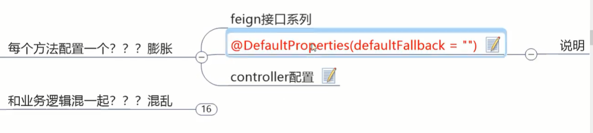

#1.解决膨胀

配一个全局通用的，没被兜住的，就找全局通用的

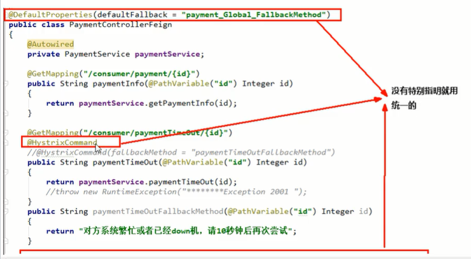

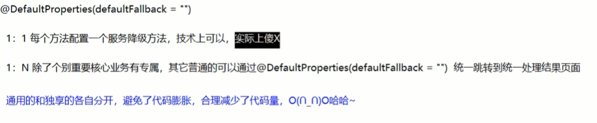

```java
//下面是全局fallback方法
public String payment_Global_FallbackMethod(){
    return "Global异常处理信息，请稍后再试";
}
```

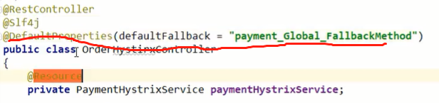


需要服务降级的方法加@HystrixCommand


#2.解决耦合

牵牛牵牛鼻子，controller层做降级，它们都调的是使用feign的接口

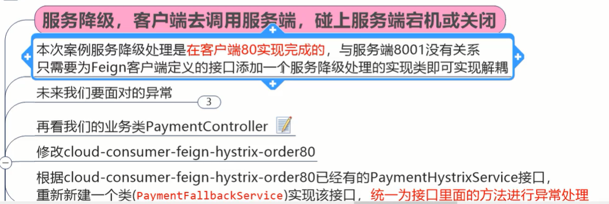

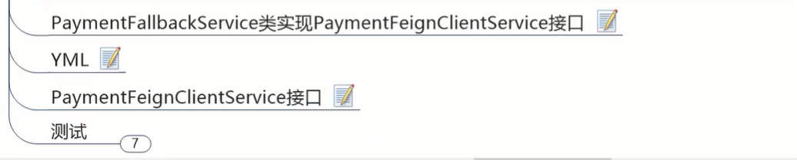


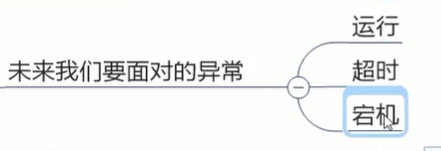

```java
@Component
public class PaymentFallbackService implements PaymentHystrixService {
    @Override
    public String paymentInfo_OK(Integer id) {
        return "PaymentFallbackService  fall back-paymentInfo_OK";
    }

    @Override
    public String paymentInfo_TimeOut(Integer id) {
        return "PaymentFallbackService  fall back-paymentInfo_TimeOut";
    }
}
```


打开feign对hystrix的支持

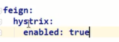

把这个类配到接口里

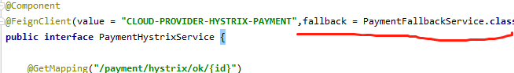


测试：

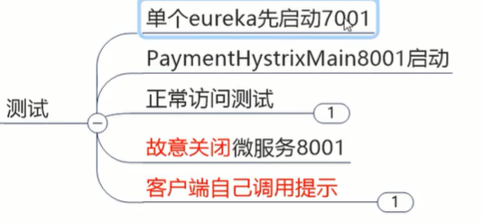


测试成功


士不可以不弘毅。


