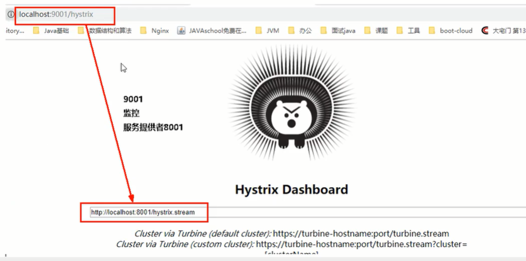

# Hystrix案例

## 服务熔断


### 熔断是什么


它跟降级不一样的地方，能恢复调用链路


如果你是分布式高手，没看过这些博客是不合适的


开，闭，半开状态

### 实操


#在service:

```java
@HystrixCommand(fallbackMethod = "paymentCircuitBreaker_fallback",commandProperties = {
        @HystrixProperty(name="circuitBreaker.enabled",value = "true"),//是否开启断路器
        @HystrixProperty(name="circuitBreaker.requestVolumeThreshold",value = "10"),//请求次数
        @HystrixProperty(name="circuitBreaker.sleepWindowInMilliseconds",value = "10000"),//时间窗口期
        @HystrixProperty(name="circuitBreaker.errorThresholdPercentage",value = "60"),//失败率达到多少后跳闸
})
public String paymentCircuitBreaker(@PathVariable("id") Integer id){
    if(id<0){
        throw new RuntimeException("****id 不能负数");
    }
    String serialNumber = IdUtil.simpleUUID();
    return Thread.currentThread().getName()+"\t"+"调用成功，流水号："+serialNumber;
}
public String paymentCircuitBreaker_fallback(@PathVariable("id")Integer id){
    return "id 不能负数，请稍后再试，id:"+id;
}
```

你怎么知道要这么用，有一天离开阳哥了，你去哪找


#在controller:

```java
@GetMapping("/payment/circuit/{id}")
public String paymentCircuitBreaker(@PathVariable("id")Integer id){
    String result = paymentService.paymentCircuitBreaker(id);
    log.info("****result:"+result);
    return result;
}
```


#测试：


说明：进入fallback就是出错了，狂点走出错，会降级，达到配置的比率会熔断，这时即使点正确也会降级

然后点正确，在一定的时间窗口期，慢慢的到一定程度，正确率高了，错误率降了，会到半开状态放过去一部分，慢慢的最终断路器到关闭状态。


### 原理(小总结)


大神结论：开，关闭，半开

熔断类型：


官网流程图：


##官网步骤：


##断路器什么情况下起作用


##断路器开启或关闭条件


##断路器打开之后


如果熔断了，直接调用降级fallback

##All配置

官网看其它全部花活配置


## 服务限流


# hystrix工作流程


官网看，不要害怕，很简单，跟着步骤看一看，hystrix提供两种构建方法，我们用的是hystrixcommand

会去看缓存，再去判断当前是否熔断，是否线程池/信号量打满，执行后是否异常，如果是就降级....


# 服务监控hystrixDashboard


## 概述


## 仪表盘9001


```xml
<dependencies>
    <dependency>
        <groupId>org.springframework.cloud</groupId>
        <artifactId>spring-cloud-starter-netflix-hystrix-dashboard</artifactId>
    </dependency>
    <dependency>
        <groupId>org.springframework.boot</groupId>
        <artifactId>spring-boot-starter-actuator</artifactId>
    </dependency>
    <dependency>
        <groupId>org.springframework.boot</groupId>
        <artifactId>spring-boot-devtools</artifactId>
        <scope>runtime</scope>
        <optional>true</optional>
    </dependency>
    <dependency>
        <groupId>org.projectlombok</groupId>
        <artifactId>lombok</artifactId>
        <optional>true</optional>
    </dependency>
    <dependency>
        <groupId>org.springframework.boot</groupId>
        <artifactId>spring-boot-starter-test</artifactId>
        <scope>test</scope>
    </dependency>

</dependencies>
```


```java
@SpringBootApplication
@EnableHystrixDashboard
public class HystrixDashboardMain9001 {
    public static void main(String[] args) {
        SpringApplication.run(HystrixDashboardMain9001.class,args);
    }
}
```


所有被监控的微服务提供者都需要监控依赖的配置


看到豪猪哥，就是hystrix的图形化监控界面


## 监控实战


```java
@Bean
public ServletRegistrationBean getServlet(){
    HystrixMetricsStreamServlet streamServlet = new HystrixMetricsStreamServlet();
    ServletRegistrationBean registrationBean = new ServletRegistrationBean(streamServlet);
    registrationBean.setLoadOnStartup(1);
    registrationBean.addUrlMappings("/hystrix.stream");
    registrationBean.setName("HystrixMetricsStreamServlet");
    return registrationBean;
}
```





七色：


1圈：


1线：


整图说明：


整图说明2：


搞懂一个才能看懂复杂的：

可以监控其它的，整屏的写满


哪个圈圈大说明哪个的压力和流量大，进行实时的监控，熔断，限流


